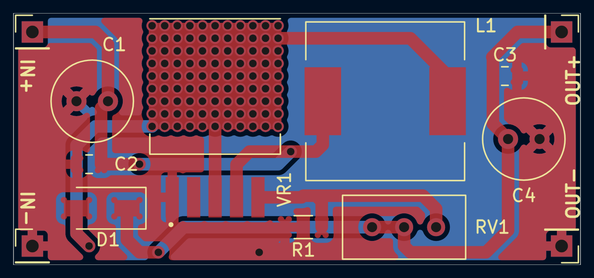
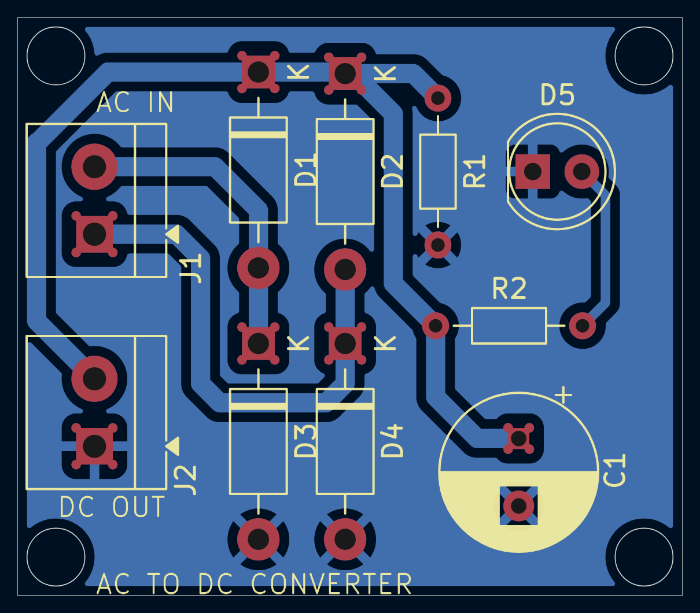
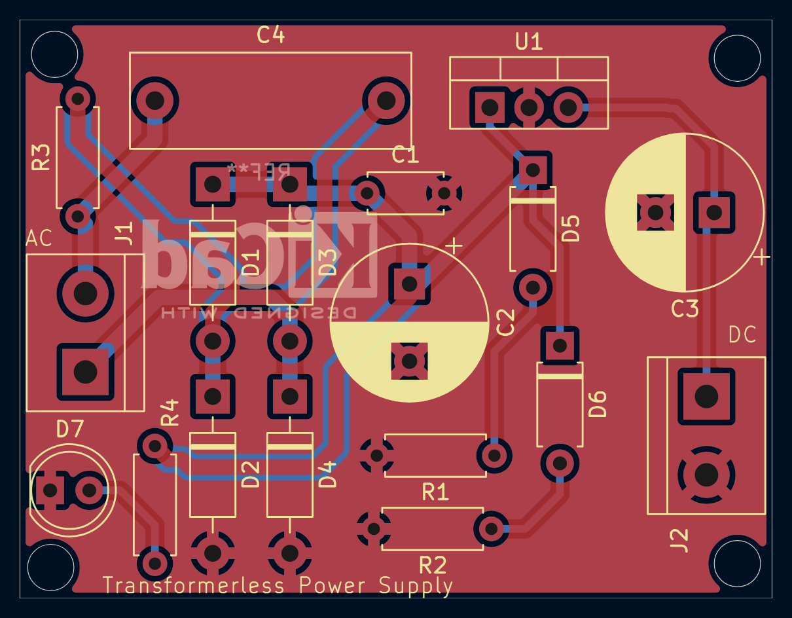
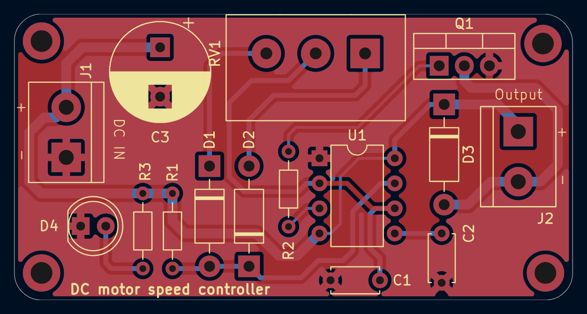
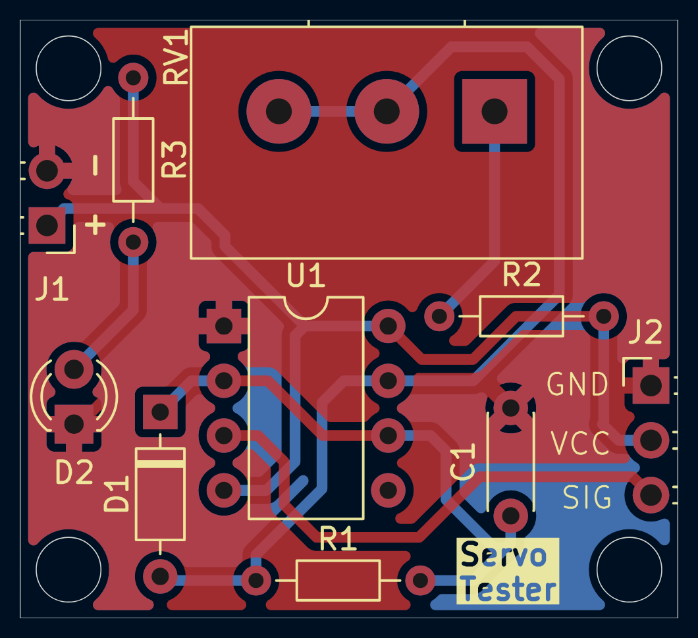
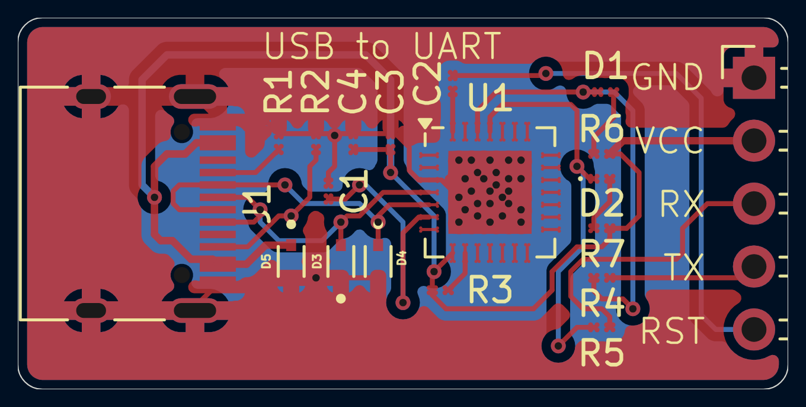
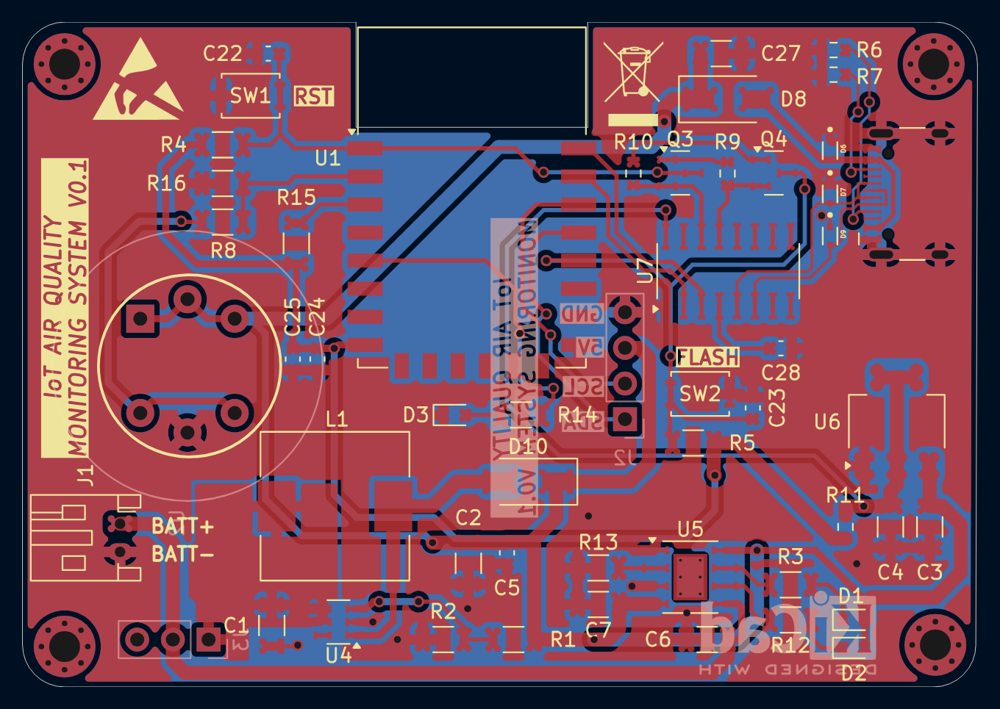
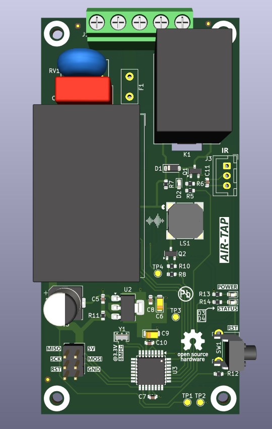

<div align="center">

# ⚡ power-converter-lib

**An open-source KiCad library of power electronics converters and embedded hardware.**
Every project ships with a schematic, PCB layout, Gerbers, working principle, design equations and build notes, ready to study, modify or send to fab.

[](https://www.kicad.org/)
[](LICENSE)


[](#-contributing)

[Projects](#-projects) · [Specs at a glance](#-specs-at-a-glance) · [Folder layout](#-what-each-folder-contains) · [Quick start](#-quick-start) · [Roadmap](#-roadmap)

</div>

---

## 🖼️ Gallery

Click any board to open its folder.

<table>
  <tr>
    <td align="center" width="25%">
      <a href="buck-converter/"></a><br/>
      <b><a href="buck-converter/">Buck Converter</a></b><br/><sub>DC-DC · Step-down</sub>
    </td>
    <td align="center" width="25%">
      <a href="boost-converter/"></a><br/>
      <b><a href="boost-converter/">Boost Converter</a></b><br/><sub>DC-DC · Step-up</sub>
    </td>
    <td align="center" width="25%">
      <a href="ac-dc-bridge-rectifier/"></a><br/>
      <b><a href="ac-dc-bridge-rectifier/">AC-DC Bridge Rectifier</a></b><br/><sub>AC-DC · Full-wave</sub>
    </td>
    <td align="center" width="25%">
      <a href="transformerless-power-supply/"></a><br/>
      <b><a href="transformerless-power-supply/">Transformerless PSU</a></b><br/><sub>AC-DC · Capacitive dropper</sub>
    </td>
  </tr>
  <tr>
    <td align="center">
      <a href="dc-motor-speed-controller/"></a><br/>
      <b><a href="dc-motor-speed-controller/">DC Motor Speed Controller</a></b><br/><sub>Motor control · PWM</sub>
    </td>
    <td align="center">
      <a href="servo-tester/"></a><br/>
      <b><a href="servo-tester/">Servo Tester</a></b><br/><sub>Motor control · 555 PWM</sub>
    </td>
    <td align="center">
      <a href="usb-to-uart-converter/"></a><br/>
      <b><a href="usb-to-uart-converter/">USB to UART Converter</a></b><br/><sub>Interface · CP2102N</sub>
    </td>
    <td align="center">
      <a href="air-quality-monitor/"></a><br/>
      <b><a href="air-quality-monitor/">IoT Air Quality Monitor</a></b><br/><sub>IoT · ESP8266</sub>
    </td>
  </tr>
  <tr>
    <td align="center">
      <a href="airtap/"></a><br/>
      <b><a href="airtap/">AirTap</a></b><br/><sub>Home automation · Touchless switch</sub>
    </td>
  </tr>
</table>

---

## 📦 Projects

### 🔋 DC-DC Converters

| Project | Topology | Key IC | Input → Output | Highlights |
|---|---|---|---|---|
| [**Buck Converter**](buck-converter/) | Step-down (non-isolated) | LM2596S-5 | 7–40 V DC → **5 V**, 3 A | 150 kHz switcher, 33 µH inductor, Schottky freewheel |
| [**Boost Converter**](boost-converter/) | Step-up (non-isolated) | XL6009 | 5–32 V DC → **adj. up to ~35 V** | 4 A switch, 400 kHz, multi-turn trimmer, thermal-via array |

### 🔌 AC-DC Converters

| Project | Topology | Key Parts | Input → Output | Highlights |
|---|---|---|---|---|
| [**AC-DC Bridge Rectifier**](ac-dc-bridge-rectifier/) | Full-wave bridge + C filter | 1N4007 ×4, 1000 µF | 12 V AC → **~15.6 V DC** (unregulated) | Bleeder resistor, LED indicator, THT-only |
| [**Transformerless Power Supply**](transformerless-power-supply/) | Capacitive dropper + LDO | X2 2.2 µF, LM7805 | 230 V AC → **5 V DC** | ⚠️ Non-isolated, mains voltage. Read the design notes |

### ⚙️ Motor Control & Signal

| Project | Topology | Key IC | Supply | Highlights |
|---|---|---|---|---|
| [**DC Motor Speed Controller**](dc-motor-speed-controller/) | 555 PWM + low-side switch | NE555 + TIP122 | 5–15 V DC, up to ~3 A | Constant-frequency PWM, 1–99 % duty, flyback diode |
| [**Servo Tester**](servo-tester/) | 555 astable, diode-steered | NE555 | 6 V DC | ~0.85–2.4 ms pulse, pot control, no code needed |

### 🧩 Interface & IoT

| Project | Function | Key IC | Supply | Highlights |
|---|---|---|---|---|
| [**USB to UART Converter**](usb-to-uart-converter/) | USB-C ↔ serial bridge | CP2102N | USB 5 V | ESD protection, TX/RX LEDs, DTR auto-reset |
| [**IoT Air Quality Monitor**](air-quality-monitor/) | Wi-Fi gas-sensing node | ESP-12E + MQ-135 | USB-C / Li-ion | TP4056 charger, MT3608 boost, CH340C auto-flash, OLED |

### 🏠 Home Automation

| Project | Function | Key IC | Supply | Highlights |
|---|---|---|---|---|
| [**AirTap**](airtap/) | Touchless AC relay switch | ATmega328 + VL53L0X | 220 V AC (HLK-5M05) | Hand-wave switching (10–30 mm), fused + MOV-protected, relay/buzzer/LEDs, test firmware. Fork of [ProxiWave-D](https://github.com/ampnics/Proxiwave-D) (MIT) |

---

## 📊 Specs at a glance

| Project | Category | Board Size | Layers | Assembly | 3D Views | KiCad Source |
|---|---|---|:---:|---|:---:|:---:|
| [Buck Converter](buck-converter/) | DC-DC | 51 × 36 mm | 2 | SMD + THT | — | ✅ |
| [Boost Converter](boost-converter/) | DC-DC | 45 × 20 mm | 2 | SMD + THT | ✅ | ✅ |
| [AC-DC Bridge Rectifier](ac-dc-bridge-rectifier/) | AC-DC | 34.6 × 30.1 mm | 2 | THT | — | ⏳ Gerbers only |
| [Transformerless PSU](transformerless-power-supply/) | AC-DC | 48.8 × 37.5 mm | 2 | THT | — | ✅ |
| [DC Motor Speed Controller](dc-motor-speed-controller/) | Motor control | 56.5 × 29 mm | 2 | THT | ✅ | ✅ |
| [Servo Tester](servo-tester/) | Signal | 30.5 × 27.8 mm | 2 | THT | — | ✅ |
| [USB to UART Converter](usb-to-uart-converter/) | Interface | 31 × 15 mm | 2 | SMD (0201, QFN) | — | ✅ |
| [IoT Air Quality Monitor](air-quality-monitor/) | IoT | 68 × 47.4 mm | 2 | SMD + THT | ✅ | ✅ |
| [AirTap](airtap/) | Home automation | 50 × 100 mm | 2 | SMD + THT | ✅ | ✅ |

---

## 🗂️ What each folder contains

Every project follows the same layout, so once you know one you know them all:

```
<project-name>/
├── README.md                     ← overview, working principle, equations, BOM, design notes
├── <project-name>.kicad_pro      ← KiCad project
├── <project-name>.kicad_sch      ← schematic source
├── <project-name>.kicad_pcb      ← PCB layout source
├── <project-name>-PTH.drl        ← plated drill file
├── <project-name>-NPTH.drl       ← non-plated drill file
├── gerbers/                      ← fab-ready Gerber set
├── schematic.png / .svg          ← schematic preview
├── pcb-layout2.png               ← KiCad editor-style layout
├── pcb-layout.png                ← top & bottom render
└── pcb-3d-*.png                  ← 3D renders (where available)
```

Each project README follows the same outline: **Overview → Working Principle → Key Equations → Applications → Specifications → BOM → Design Notes → Pros & Cons → Files → How to Use**.

---

## 🚀 Quick start

```bash
# 1. Clone the library
git clone https://github.com/ajkumar-1907/power-converter-lib.git
cd power-converter-lib

# 2. Open any project in KiCad 10+
#    e.g. boost-converter/boost-converter.kicad_pro
```

### 🏭 Ordering a PCB

1. Open the project folder you want.
2. Zip the contents of `gerbers/` **together with** the two `.drl` files.
3. Upload the zip to any PCB fab (JLCPCB, PCBWay, etc.). The default 2-layer, 1.6 mm FR-4 settings work for every board here.
4. **Read the project's Design Notes before ordering.** Some boards list parts that need values set or ratings checked.

---

## 🗺️ Roadmap

- [x] Buck converter (LM2596)
- [x] Boost converter (XL6009)
- [x] Full-wave bridge rectifier
- [x] Transformerless (capacitive dropper) supply
- [x] PWM DC motor speed controller
- [ ] Buck-boost / SEPIC converter
- [ ] Flyback converter (isolated)
- [ ] Dual Active Bridge (bidirectional DC-DC)
- [ ] DC-AC inverter (H-bridge, SPWM)
- [ ] AC-AC converter (TRIAC phase control)
- [ ] KiCad source for the AC-DC bridge rectifier

---

## 🤝 Contributing

Contributions are welcome: new topologies, layout improvements, corrections to equations or BOMs.

1. Fork the repo and create a branch (`git checkout -b add-sepic-converter`).
2. Add your project as a new folder that follows the [standard layout](#-what-each-folder-contains).
3. Open a pull request describing the design and how it was verified.

Found a mistake? [Open an issue](https://github.com/ajkumar-1907/power-converter-lib/issues).

---

## ⚠️ Safety

Several projects work with **mains voltage** or **high currents**. The Transformerless Power Supply and AirTap connect directly to mains, and the Transformerless Power Supply in particular is **not isolated**: every point on it, including the output, can be at lethal potential. Only build these if you understand the risks, and always read each project's Design Notes first.

---

## 📄 License

Released under the [MIT License](LICENSE): free to use, modify and build on, including commercially.

<div align="center">

Designed by **[Anuj Kumar](https://github.com/ajkumar-1907)**, B.Tech Electrical Engineering, Delhi Technological University

⭐ If this library helped you, consider starring the repo!

</div>
