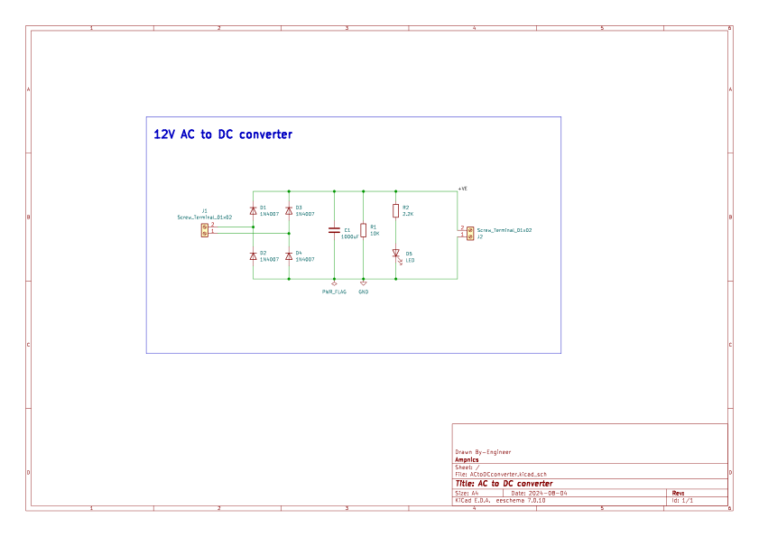
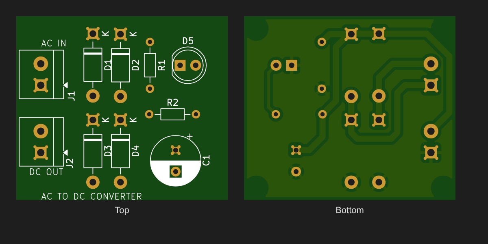

# AC-DC Bridge Rectifier

An AC-to-DC converter that turns low-voltage AC from a step-down transformer into unregulated DC. It uses a four-diode full-wave bridge, a capacitor filter and an LED power indicator.





## Overview

The full-wave bridge rectifier is the most common front end in linear power supplies. Four diodes steer both half-cycles of the AC input so that current always flows through the load in the same direction. A reservoir capacitor then smooths the pulsating output into near-steady DC. The output is **unregulated**: it rises and falls with the input voltage and sags under load. It is usually followed by a linear regulator (78xx / LM317) or a DC-DC converter.

## Working Principle

1. **Positive half-cycle:** two diodes on opposite arms of the bridge are forward-biased. Current flows from the AC source, through the load, and back.
2. **Negative half-cycle:** the other two diodes conduct and steer current through the load **in the same direction**. The output is a full-wave rectified waveform at twice the line frequency (100 Hz on 50 Hz mains).
3. **Filtering:** C1 charges to the peak voltage on each half-cycle and supplies the load between peaks. The size of C1 sets the output ripple.
4. **Bleeder:** R1 discharges C1 when power is removed, so the board is safe to handle.
5. **Indicator:** D5 lights through current-limiting resistor R2 whenever DC is present.

## Key Equations

**Peak DC output (no load):**
```
Vdc(peak) = √2 × Vrms − 2 × Vf
```
where Vf ≈ 0.7 V per diode (two diodes conduct at a time).
For 12 V AC: `1.414 × 12 − 1.4 ≈ 15.6 V`

**Output ripple (full-wave, capacitor filter):**
```
ΔV = I_load / (2 × f × C)
```
where f = line frequency. For 100 mA at 50 Hz with C = 1000 µF: `ΔV ≈ 1 V p-p`

**Average DC output under load:**
```
Vdc(avg) ≈ Vdc(peak) − ΔV / 2
```

**Diode peak inverse voltage (PIV) per diode:**
```
PIV ≈ √2 × Vrms ≈ 17 V   (1N4007 is rated at 1000 V)
```

**LED current:**
```
I_LED = (Vdc − V_LED) / R2 = (15.6 − 2) / 2200 ≈ 6 mA
```

**Bleeder discharge time constant:**
```
τ = R1 × C1 = 10 kΩ × 1000 µF = 10 s
```

## Typical Applications

- Front end for linear regulated supplies (transformer → bridge → filter → 7805/7812/LM317)
- Battery-charger and DC-motor supplies that can tolerate ripple
- Powering relays, solenoids and other loads that don't need regulated DC
- Teaching and lab demonstrations of rectification and filtering

## Specifications (this design)

| Parameter | Value |
|---|---|
| Input Voltage | 12 V AC RMS, 50/60 Hz (transformer secondary) |
| Output Voltage | ≈ 15.6 V DC no-load, unregulated |
| Output Current | Up to 1 A (1N4007 limit); ≤ 300 mA recommended to keep ripple low |
| Output Ripple | ≈ 1 V p-p at 100 mA, 50 Hz |
| Ripple Frequency | 100 Hz (on 50 Hz mains) |
| Board Size | 34.55 × 30.05 mm, 2-layer, 1.6 mm FR-4 |

## Bill of Materials

| Ref | Value | Package | Qty |
|---|---|---|---|
| D1–D4 | 1N4007 rectifier diode | DO-41, THT | 4 |
| C1 | 1000 µF electrolytic, **≥ 25 V** | Radial, THT | 1 |
| R1 | 10 kΩ, ¼ W (bleeder) | Axial, THT | 1 |
| R2 | 2.2 kΩ, ¼ W (LED limiter) | Axial, THT | 1 |
| D5 | 5 mm LED | THT | 1 |
| J1, J2 | 2-pin screw terminal, 5.08 mm | THT | 2 |

All parts are through-hole, so the board is easy to hand-solder.

## Pros & Cons

**Pros:**
- Very simple and cheap, and highly reliable
- Full-wave rectification uses the transformer better than a half-wave rectifier
- Ripple at twice the line frequency is easier to filter than half-wave ripple

**Cons:**
- Unregulated: the output varies with line voltage and load
- Two diode drops (~1.4 V) waste power, which matters at low output voltages
- Needs a bulky 50/60 Hz transformer for isolation and step-down
- The capacitor-input filter draws peaky current, which gives a poor power factor

## Files in This Folder

| File | Description |
|---|---|
| `ac-dc-bridge-rectifier.kicad_pro` | KiCad project file |
| `ac-dc-bridge-rectifier.kicad_sch` | Schematic source file |
| `ac-dc-bridge-rectifier.kicad_pcb` | PCB layout source file |
| `ac-dc-bridge-rectifier-PTH.drl` | Plated through-hole drill file |
| `ac-dc-bridge-rectifier-NPTH.drl` | Non-plated through-hole drill file |
| `gerbers/` | Gerber files (copper, mask, silkscreen, paste, edge cuts, job file) |
| `schematic.svg` | Schematic preview image |
| `pcb-layout.png` | PCB preview (top and bottom) rendered from the Gerbers |

## How to Use

1. Clone or download this repository.
2. Open `ac-dc-bridge-rectifier.kicad_pro` in [KiCad](https://www.kicad.org/) (v10 or later; the design was made in KiCad 10.0.6).
3. To manufacture, zip the contents of `gerbers/` together with the two `.drl` files and upload them to any PCB fab (JLCPCB, PCBWay, etc.).
4. To change the output, use a transformer with a different secondary voltage, and resize C1 for your load current using the ripple equation above. Check that C1's voltage rating is above √2 × Vrms.

> ⚠️ **Safety:** connect J1 **only** to the low-voltage secondary of an isolation/step-down transformer, never directly to mains. Check C1's polarity before powering up.

## License

Released under the [MIT License](../LICENSE).
