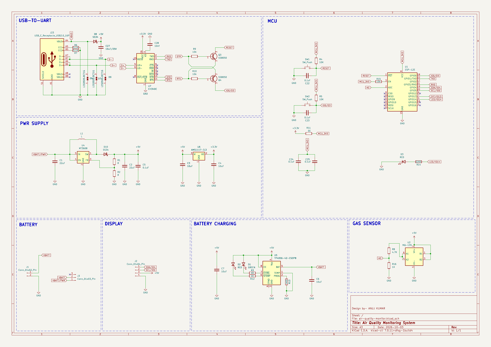
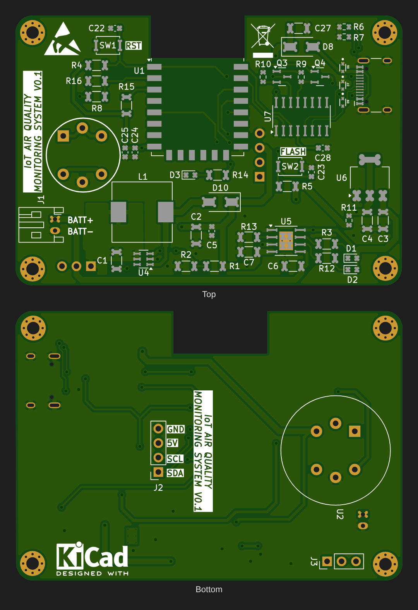
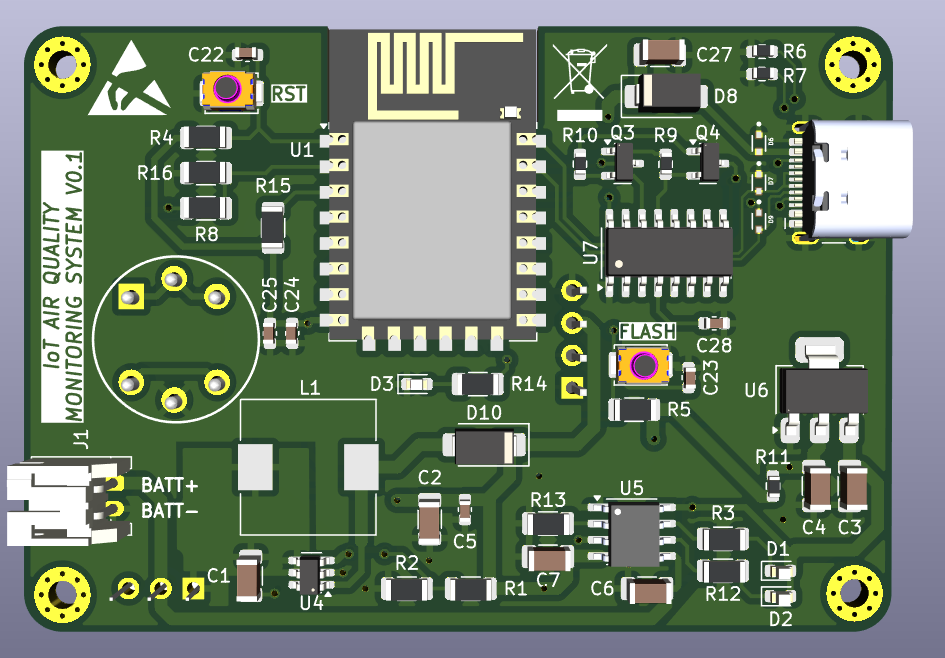
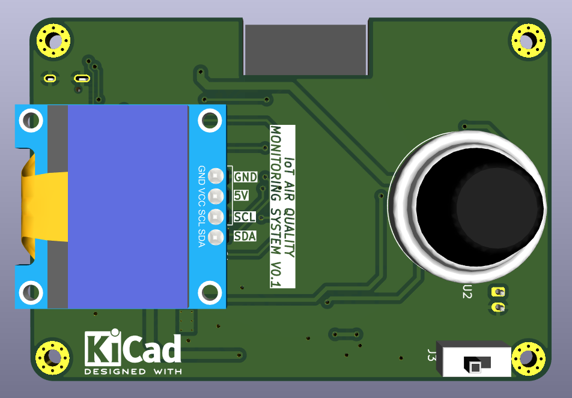
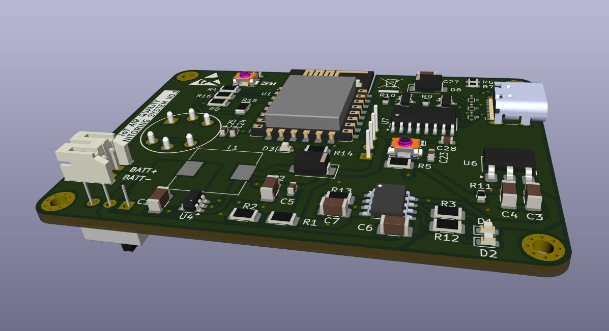
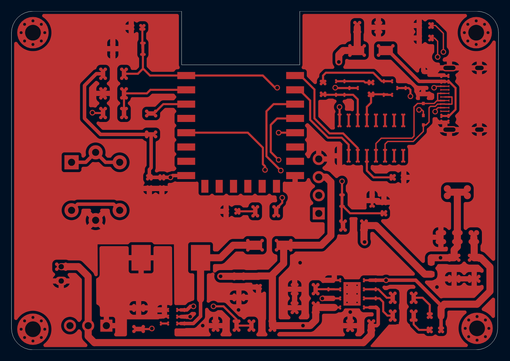
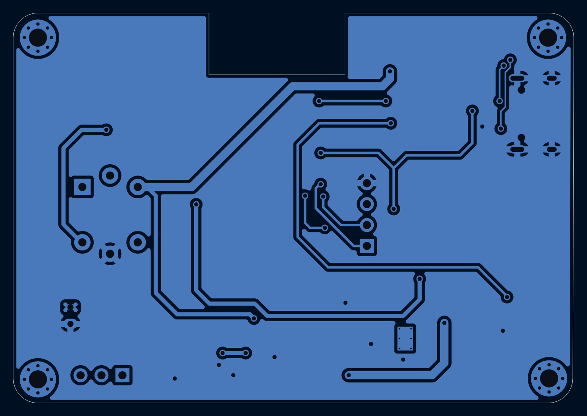
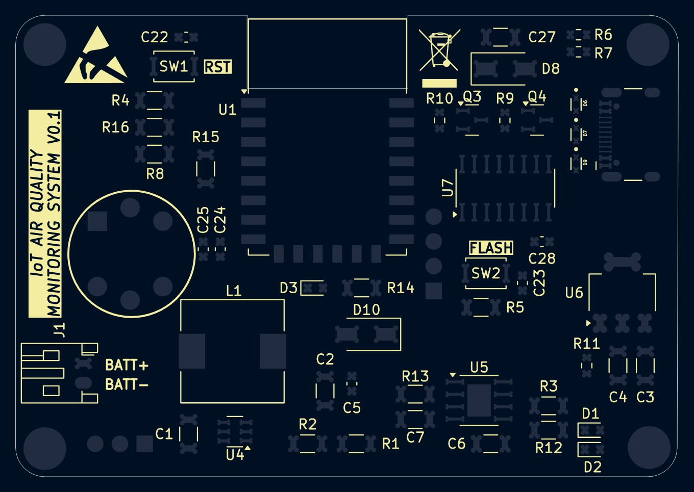
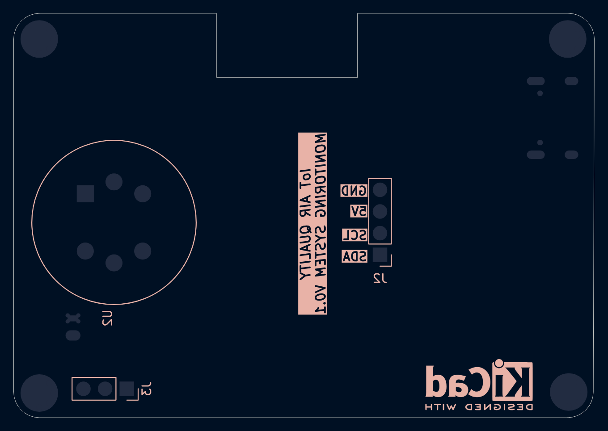

# IoT Air Quality Monitoring System

A battery-powered, Wi-Fi connected air-quality monitor built around an **ESP-12E (ESP8266)** and an **MQ-135** gas sensor. It reads gas concentration, shows it on an SSD1306 OLED, and can send the data over Wi-Fi. The board has its own USB-C programming interface, a Li-ion charger and power regulation.






### 3D views







### Layer views

| Front copper | Back copper |
|---|---|
|  |  |
| **Front silkscreen** | **Back silkscreen** |
|  |  |

## Overview

The board combines six functional blocks on one 2-layer PCB:

| Block | Parts | Function |
|---|---|---|
| **USB-to-UART** | USB-C (J23), CH340C (U7), SS8050 ×2 (Q3, Q4) | Programming and serial monitor over USB-C, with ESP auto-reset/flash |
| **MCU** | ESP-12E (U1), RST and FLASH buttons | Wi-Fi microcontroller; reads the sensor and drives the display |
| **Gas sensor** | MQ-135 (U2) + load/divider resistors | Analog gas reading into the ESP8266 ADC (A0) |
| **Display** | 4-pin header (J2) | SSD1306 128×64 I²C OLED (GND / 5V / SCL / SDA) |
| **Battery charging** | TP4056 (U5), status LEDs D1/D2 | Single-cell Li-ion charging from USB |
| **Power supply** | MT3608 boost (U4) + AMS1117-3.3 (U6) | Battery → 5 V (sensor heater, OLED) → 3.3 V (ESP-12E) |

## Working Principle

1. **Power path:** USB-C supplies 5 V. The CC pins have 5.1 kΩ pull-downs (R6, R7), so a USB-C host provides power, and TVS diodes (D6, D7, D9) protect the USB lines. The TP4056 charges the Li-ion cell on J1 at about 1 A (set by R13 = 1.2 kΩ). The red and green LEDs show charging and done.
2. **5 V rail:** the MT3608 boosts the battery voltage (3.0–4.2 V) to 5 V through L1 and Schottky diode D10. USB 5 V is OR-ed onto the same rail through D8 (SS34), so the board runs from USB or from battery.
3. **3.3 V rail:** the AMS1117-3.3 LDO powers the ESP-12E from the 5 V rail.
4. **Sensing:** the MQ-135's heater runs from 5 V. Its sensing element forms a divider with the load resistors, and the scaled voltage goes to the ESP8266's ADC pin. The resistance falls as pollutant gas concentration rises (NH₃, NOₓ, alcohol, benzene, smoke, CO₂).
5. **Programming:** the CH340C converts USB to UART. Its DTR and RTS lines drive the classic two-transistor (Q3, Q4) circuit that pulls the ESP's RESET and GPIO0, so uploads from the Arduino IDE or esptool need no button presses. Manual RST and FLASH buttons are also provided.
6. **Display and I/O:** the OLED connects over I²C (SDA/SCL on J2). D3 is a status LED on GPIO14.

## Key Equations

**TP4056 charge current:**
```
I_charge = 1200 / R_PROG = 1200 / 1.2 kΩ ≈ 1 A
```

**MT3608 boost output (V_FB = 0.6 V):**
```
Vout = 0.6 V × (1 + R_top / R_bottom)      for 5 V: R_top / R_bottom ≈ 7.33
```

**MQ-135 sensor resistance from the measured voltage:**
```
Rs = R_L × (Vc − V_out) / V_out          ppm ≈ a × (Rs / R0)^b   (calibrated curve)
```

**ESP8266 ADC input (0–1 V full scale on ESP-12E A0):**
```
V_ADC = V_sensor × R_bottom / (R_top + R_bottom)   →  must stay ≤ 1.0 V
```

## Typical Applications

- Indoor air-quality monitoring for homes, classrooms and offices
- Kitchen and garage smoke or gas alerts
- IoT dashboards (Blynk, ThingSpeak, MQTT / Home Assistant)
- Learning platform for ESP8266, sensors and battery-powered design

## Specifications (this design)

| Parameter | Value |
|---|---|
| MCU | ESP-12E (ESP8266, 2.4 GHz Wi-Fi) |
| Sensor | MQ-135 (analog) |
| Display | SSD1306 128×64 OLED, I²C |
| Power Input | USB-C 5 V |
| Battery | 1-cell Li-ion / Li-Po (JST-PH 2-pin), 1 A charging |
| Rails | 5 V (MT3608 boost / USB) and 3.3 V (AMS1117) |
| USB-UART | CH340C with auto-reset / auto-flash |
| Board Size | 68 × 47.4 mm, 2-layer, antenna keep-out cut-out |

## Bill of Materials

The full BOM is in [`bom.csv`](bom.csv). The main parts are:

| Ref | Value | Package |
|---|---|---|
| U1 | ESP-12E | Module |
| U2 | MQ-135 gas sensor | 6-pin |
| U4 | MT3608 boost converter | SOT-23-6 |
| U5 | TP4056 Li-ion charger | ESOP-8 |
| U6 | AMS1117-3.3 LDO | SOT-223 |
| U7 | CH340C USB-UART | SOIC-16 |
| Q3, Q4 | SS8050 NPN | SOT-23 |
| D8, D10 | SS34 Schottky | SMA |
| D6, D7, D9 | LESD5D5.0CT1G TVS | SOD-523 |
| J23 | USB-C receptacle, 16-pin | SMD |
| J1 / J2 / J3 | JST-PH battery / OLED header / 3-pin header | THT |

## Design Notes

- **MT3608 parts not specified.** R1, R2 (feedback divider) and L1 are left as "R" and "L" in the schematic. Pick R_top / R_bottom ≈ 7.33 for 5 V (for example 22 kΩ / 3 kΩ) and a 22 µH power inductor rated above about 2 A before ordering.
- **ADC range.** The ESP-12E's A0 pin reads 0–1 V. Check that the sensor divider keeps the maximum reading under 1 V.
- **Sensor warm-up and power.** The MQ-135 heater draws about 150 mA at 5 V and needs a 24–48 h burn-in plus calibration (R0 in clean air) before readings are meaningful. On battery it is the dominant load, so consider duty-cycling the heater or deep sleep for long runtime.
- **Antenna.** Keep the cut-out and keep-out zone under the ESP-12E antenna free of copper and components for good Wi-Fi range.
- **Firmware** isn't included in this folder. The 3D models used for the renders (OLED, sensor, USB-C, etc.) aren't included either; KiCad shows those parts without a 3D body.

## Pros & Cons

**Pros:**
- All-in-one: MCU, sensor, display, charger and programmer on a single board
- USB-C with ESD protection and one-click auto-flash
- Runs from USB or battery (power OR-ing)
- Wi-Fi connectivity for cloud dashboards

**Cons:**
- MQ-135 is a low-cost, broad-spectrum sensor: it is not selective and needs calibration
- The heater current limits battery life
- The AMS1117 LDO is inefficient from 5 V
- The ESP8266 has only one ADC channel (0–1 V)

## Files in This Folder

| File | Description |
|---|---|
| `air-quality-monitor.kicad_pro` | KiCad project file |
| `air-quality-monitor.kicad_sch` | Schematic source file |
| `air-quality-monitor.kicad_pcb` | PCB layout source file |
| `air-quality-monitor-PTH.drl` | Plated through-hole drill file (incl. USB-C shell slots) |
| `air-quality-monitor-NPTH.drl` | Non-plated drill file |
| `gerbers/` | Gerber files for fabrication (incl. paste layers for stencil) |
| `bom.csv` | Bill of materials |
| `schematic.png` | Schematic image |
| `pcb-layout2.png` | PCB layout preview (KiCad editor view) |
| `pcb-layout.png` | PCB top and bottom render from the Gerbers |
| `pcb-front-copper.png` / `pcb-back-copper.png` | Copper layer views |
| `pcb-front-silkscreen.png` / `pcb-back-silkscreen.png` | Silkscreen layer views |
| `pcb-3d-top.png` / `pcb-3d-bottom.png` / `pcb-3d-angle.png` | 3D renders |

## How to Use

1. Clone or download this repository.
2. Open `air-quality-monitor.kicad_pro` in [KiCad](https://www.kicad.org/) (v10 or later).
3. Set values for R1, R2 and L1 (see Design Notes), then order the PCB: zip the contents of `gerbers/` together with the two `.drl` files and upload them to any fab.
4. After assembly, plug in USB-C. The board shows up as a CH340 COM port. Flash it from the Arduino IDE (board: *NodeMCU 1.0 (ESP-12E)*) or with esptool.
5. Connect the OLED to J2 and a 1-cell Li-ion battery to J1, then let the MQ-135 burn in before calibrating.

## License

Released under the [MIT License](../LICENSE).
