# AirTap: Touchless AC Switch

A touchless, proximity-triggered relay controller for **220 V AC** loads. Hold your hand 10–30 mm above the sensing area and a **VL53L0X time-of-flight sensor** detects it. The **ATmega328** then toggles an onboard relay to switch a lamp, fan or other mains appliance, with no physical contact.

> **Credit:** AirTap is a fork of **[ProxiWave-D (PWD-v010A)](https://github.com/ampnics/Proxiwave-D)** by **Ampnics**, released under the MIT License. The circuit, PCB layout and test firmware are Ampnics' original design. This fork re-brands the board silkscreen as "AIR-TAP", ports the project to KiCad 10, and adds Gerbers, renders and documentation. See [`NOTICE.md`](NOTICE.md).

> ⚠️ **DANGER: mains voltage.** The AC side of this board carries 220 V. Never touch it while it's powered, keep it in an enclosure, and only build it if you're experienced with mains wiring.

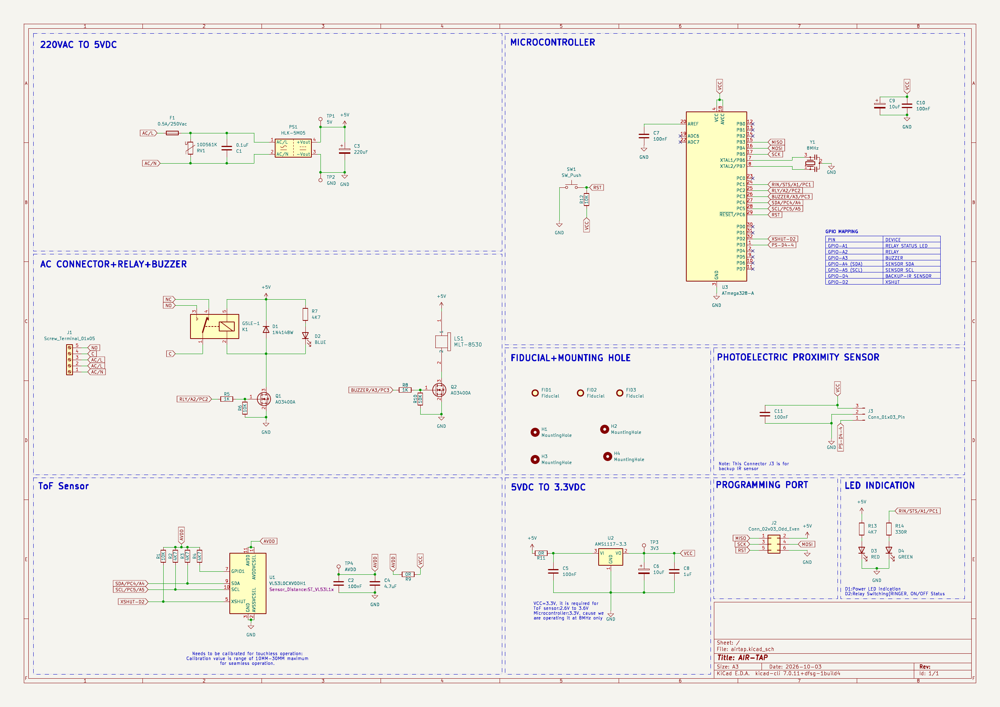

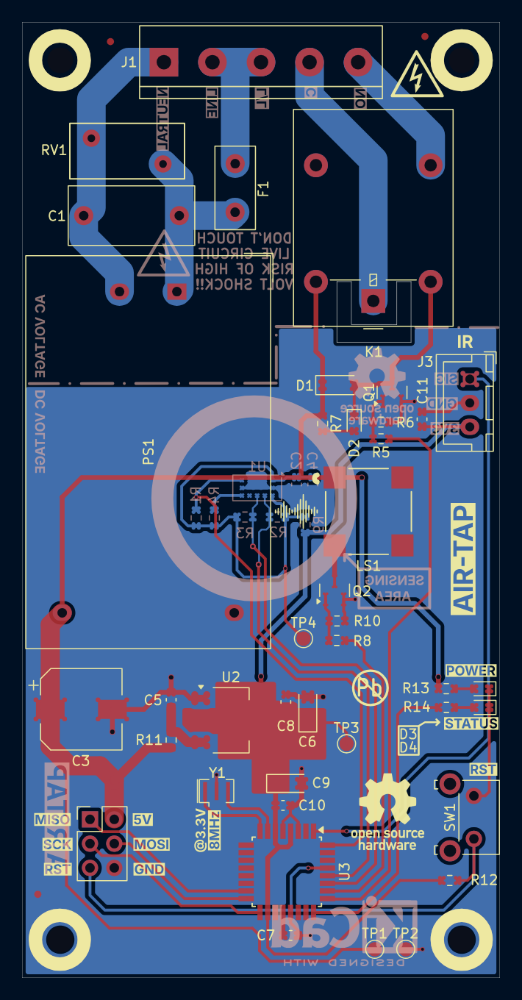

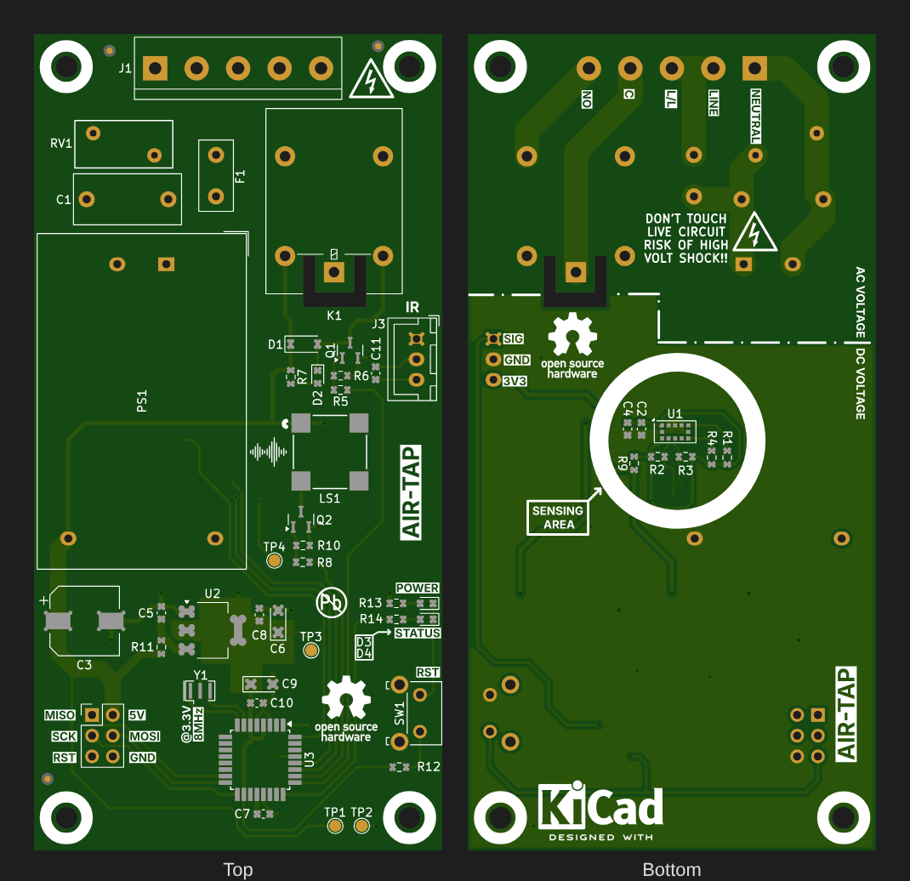

### 3D views

| Top | Bottom (sensor side) |
|---|---|
|  | 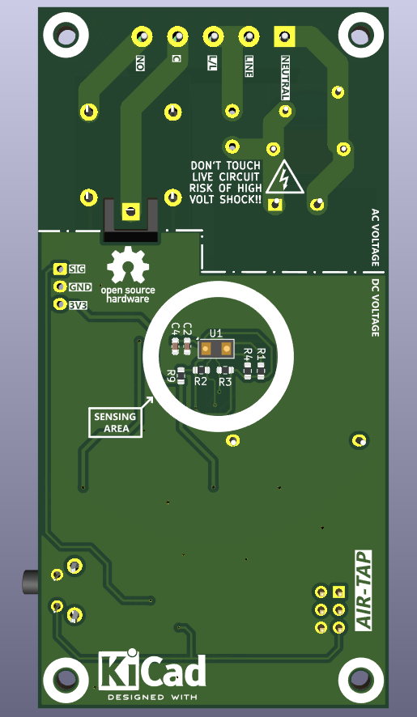 |

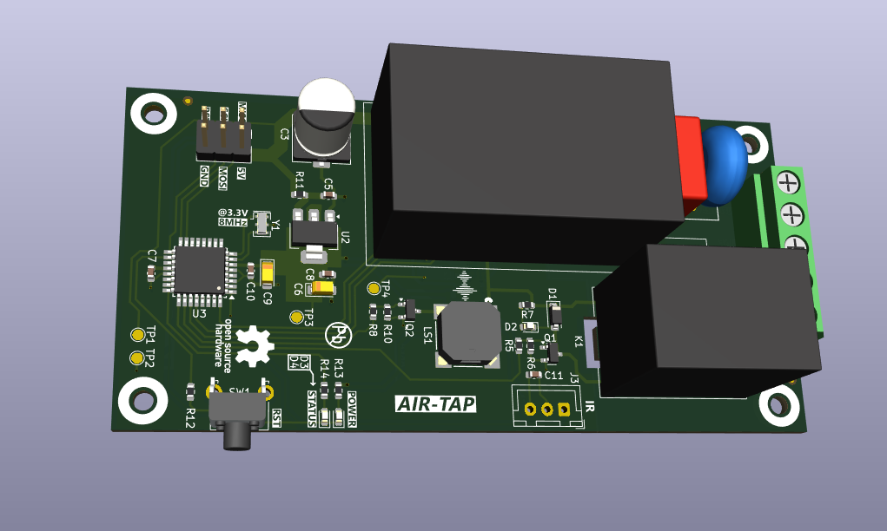

### Schematic sections

| 220 VAC → 5 VDC | AC connector, relay & buzzer |
|---|---|
| 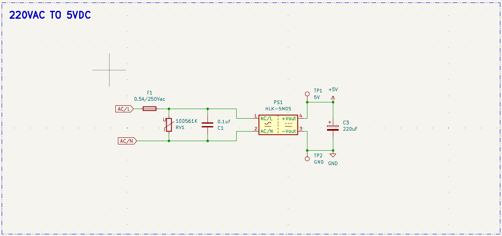 | 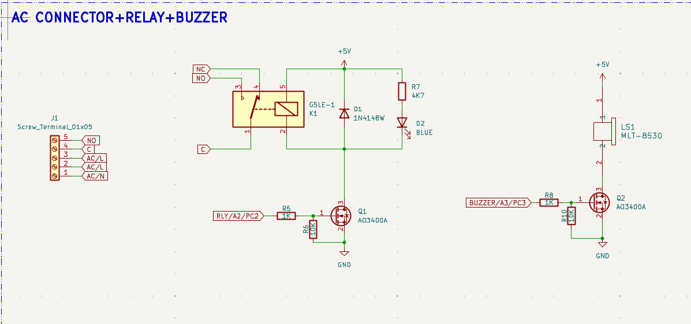 |
| **ToF sensor** | **Microcontroller** |
| 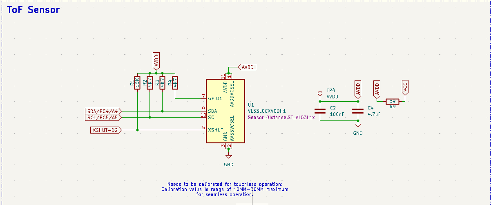 | 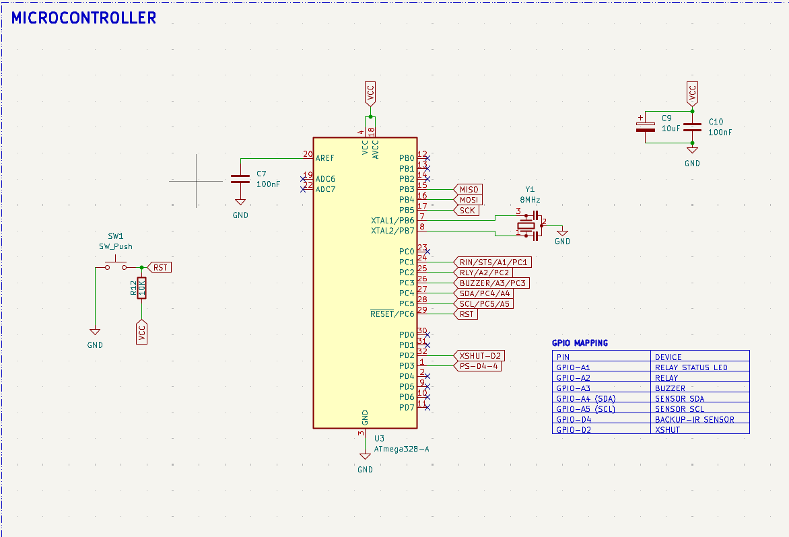 |

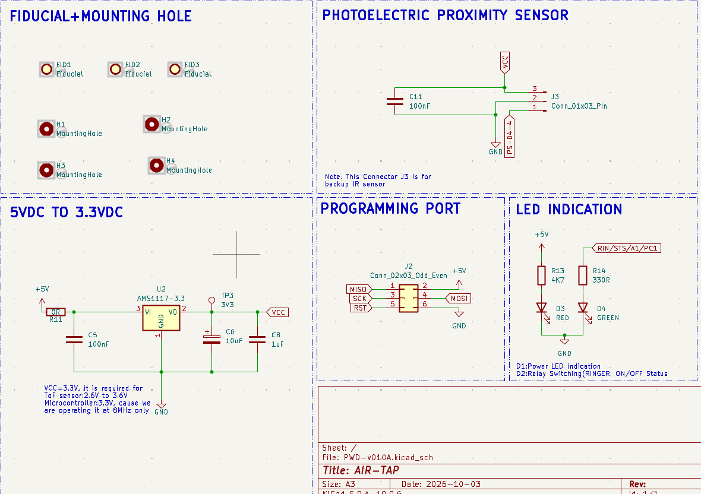

### Layer views

| Front copper | Back copper |
|---|---|
| 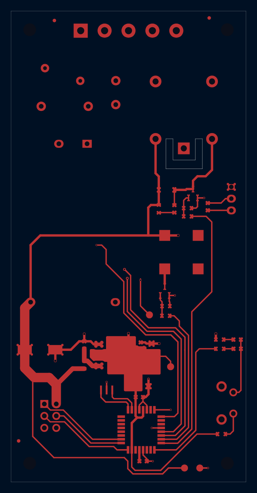 | 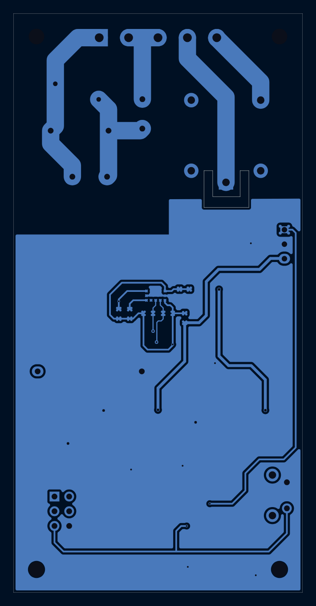 |
| **Front silkscreen** | **Back silkscreen** |
| 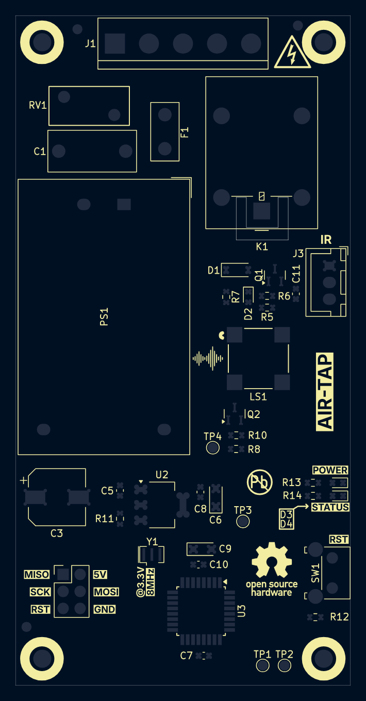 | 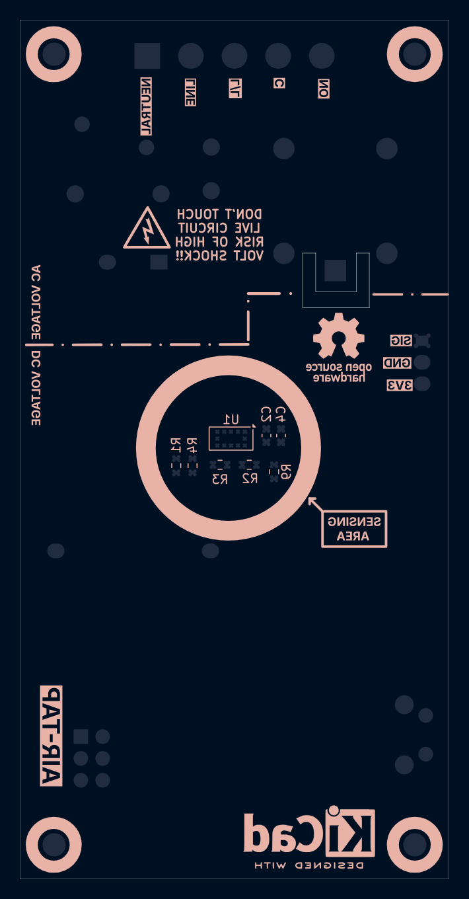 |

## Overview

| Block | Parts | Function |
|---|---|---|
| **220 VAC → 5 VDC** | F1 fuse, RV1 MOV, C1, PS1 HLK-5M05, C3 | Fused, surge-protected isolated AC-DC module |
| **5 V → 3.3 V** | U2 AMS1117-3.3 + decoupling | Powers the MCU and sensor |
| **Microcontroller** | U3 ATmega328-A, Y1 8 MHz, SW1 reset | Reads the sensor, drives the relay, buzzer and LEDs |
| **ToF sensor** | U1 VL53L0X, I²C pull-ups | Measures hand distance (10–30 mm trigger window) |
| **Relay and buzzer** | K1 G5LE-1, Q1/Q2 AO3400A, D1 flyback, LS1 MLT-8530 | Switches the AC load; audible feedback |
| **Indicators** | D2 blue (relay), D3 red (power), D4 green (status) | Visual status |
| **Programming** | J2 2×3 ICSP | Flash with USBasp / AVRISP |
| **Backup sensor** | J3 3-pin | Optional IR proximity sensor input |

## Working Principle

1. **Power:** mains enters on J1 (LINE / NEUTRAL) through fuse F1 (0.5 A). MOV RV1 (10D561K) clamps surges, and the HLK-5M05 isolated module produces 5 V. The AMS1117 then makes 3.3 V for the ATmega328 and the VL53L0X.
2. **Sensing:** the VL53L0X sends out infrared laser pulses and measures their time of flight. The ATmega328 reads the distance over I²C (SDA = PC4, SCL = PC5).
3. **Decision:** when a hand is held inside the calibrated **10–30 mm** window, the firmware toggles the load state.
4. **Switching:** PC2 drives Q1 (AO3400A logic-level MOSFET), which energises relay K1. D1 clamps the coil's flyback spike. The relay's NO / C / NC contacts are brought out on J1.
5. **Feedback:** PC3 drives the buzzer through Q2, the blue LED shows the relay state, and the green LED (PC1) shows status.

## GPIO Mapping

| ATmega328 Pin | Signal | Function |
|---|---|---|
| PC1 / A1 | STS | Relay status LED |
| PC2 / A2 | RLY | Relay driver (Q1) |
| PC3 / A3 | BUZZER | Buzzer driver (Q2) |
| PC4 / A4 | SDA | VL53L0X I²C data |
| PC5 / A5 | SCL | VL53L0X I²C clock |
| PD2 / D2 | XSHUT | VL53L0X shutdown / reset |
| PD4 / D4 | IR-BKP | Backup IR sensor (J3) |

## J1: AC Terminal (5-way)

| Pin | Label | Description |
|---|---|---|
| 1 | L/L | AC line (live) in |
| 2 | N | AC neutral in |
| 3 | NO | Relay normally-open |
| 4 | C | Relay common |
| 5 | NC | Relay normally-closed |

Wire the load between **NO** and neutral, and connect **C** to line, so the load is off until triggered.

## Key Equations

**ToF ranging:**
```
d = (c × t) / 2        c = 3×10⁸ m/s, t = round-trip time of the laser pulse
```

**Relay coil drive (G5LE-1, 5 V coil ≈ 72 Ω):**
```
I_coil ≈ 5 V / 72 Ω ≈ 70 mA      → switched by AO3400A (R_DS(on) ≈ 30 mΩ at V_GS = 2.5 V)
```

**LED current (3.3 V rail):**
```
I_LED = (3.3 − V_F) / R      e.g. (3.3 − 2.0) / 330 Ω ≈ 4 mA
```

## Specifications

| Parameter | Value |
|---|---|
| Input | 220 V AC, 50 Hz |
| Load Switching | SPDT relay (G5LE-1), NO / C / NC on screw terminal |
| Logic Supply | 5 V (HLK-5M05) → 3.3 V (AMS1117) |
| MCU | ATmega328-A @ 8 MHz, 3.3 V |
| Sensor | VL53L0X ToF, 10–30 mm calibrated trigger |
| Protection | 0.5 A fuse, 10D561K MOV, flyback diode |
| Programming | ICSP 2×3 |
| Board Size | 50 × 100 mm, 2-layer, 4 × M2.5 mounting holes, fiducials |

## Bill of Materials (key parts)

| Ref | Value | Package |
|---|---|---|
| PS1 | HLK-5M05 (220 VAC → 5 V) | Module |
| U3 | ATmega328-A | TQFP-32 |
| U1 | VL53L0CXV0DH1 (VL53L0X) | LGA |
| U2 | AMS1117-3.3 | SOT-223 |
| K1 | Omron G5LE-1 relay, 5 V coil | THT |
| Q1, Q2 | AO3400A N-MOSFET | SOT-23 |
| D1 | 1N4148W | SOD-123 |
| F1 | 0.5 A / 250 VAC fuse | Littelfuse 395 |
| RV1 | 10D561K MOV | Disc 12 mm |
| C1 | 0.1 µF X2 film | 13 × 6 mm |
| C3 | 220 µF electrolytic | 8 × 10 mm |
| LS1 | MLT-8530 buzzer | SMD |
| Y1 | 8 MHz resonator | SMD 3-pin |
| J1 | 5-way screw terminal, 5.08 mm | THT |

Plus 0603 resistors, capacitors and LEDs; see the schematic for full values.

## Firmware

Test sketches by the original author are in [`firmware/test-codes/`](firmware/test-codes/):

| Sketch | Tests |
|---|---|
| `ToF-Sensor` | VL53L0X I²C ranging (prints distance over UART) |
| `Relay` | Relay coil driver and flyback diode |
| `Relay-Led` | Relay status LED |
| `Buzzer` | Buzzer driver |

**Setup:** in the Arduino IDE, install **MiniCore** (board manager URL `https://raw.githubusercontent.com/MCUdude/MiniCore/master/package_MCUdude_MiniCore_index.json`), then choose *ATmega328, External 8 MHz, 3.3 V*. Install the **VL53L0X** library by Pololu, and flash through J2 with a USBasp.

## Design Notes

- **J3 footprint:** the backup IR connector (J3) has no footprint assigned in the schematic, although the PCB has one. Assign it, for example `PinHeader_1x03_P2.54mm`, before running "Update PCB from Schematic", or KiCad will flag it.
- **Isolation:** the AC/DC boundary is marked on the silkscreen. For extra safety, consider adding a routed isolation slot between the mains section and the logic section.
- **C1** must be an **X2-rated** safety capacitor.
- **Load rating:** the relay is rated 10 A, but the fuse (0.5 A) protects the logic supply only. Fuse the load circuit separately, sized for your appliance.
- **3D models:** the vendor 3D models (relay, buzzer, terminal, switch) aren't included, so KiCad's 3D viewer shows those parts without a body. The 3D renders in this folder were made with them.

## Files in This Folder

| File | Description |
|---|---|
| `airtap.kicad_pro` / `.kicad_sch` / `.kicad_pcb` | KiCad 10 project, schematic and PCB |
| `airtap-PTH.drl` / `airtap-NPTH.drl` | Drill files |
| `gerbers/` | Gerber set for fabrication (incl. paste layers) |
| `firmware/test-codes/` | Arduino test sketches (original author) |
| `schematic.png` | Full schematic image |
| `schematic-*.png` | Schematic section close-ups |
| `pcb-3d-top.png` / `pcb-3d-bottom.png` / `pcb-3d-angle.png` | 3D renders |
| `pcb-layout2.png` / `pcb-layout.png` | Layout previews |
| `pcb-front-copper.png` / `pcb-back-copper.png` | Copper layer views |
| `pcb-front-silkscreen.png` / `pcb-back-silkscreen.png` | Silkscreen layer views |
| `NOTICE.md` | Original copyright and license notice |

## How to Use

1. Open `airtap.kicad_pro` in [KiCad](https://www.kicad.org/) 10 or later.
2. To manufacture, zip `gerbers/` together with the two `.drl` files and upload them to any PCB fab.
3. After assembly, flash the test sketches through J2 to check each block, then load your main firmware.
4. Calibrate the trigger distance (10–30 mm) for your enclosure.

## License

The original ProxiWave-D design is © Ampnics, released under the MIT License (see [`NOTICE.md`](NOTICE.md)). Changes in this fork are released under the repository's [MIT License](../LICENSE).
