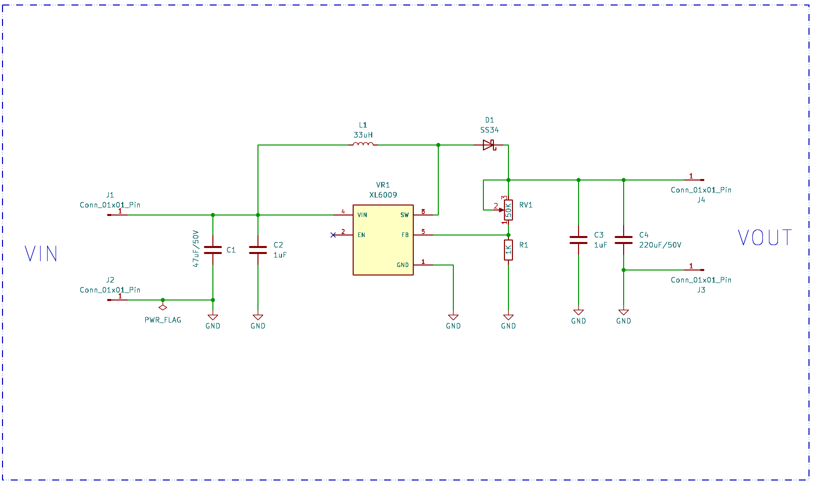
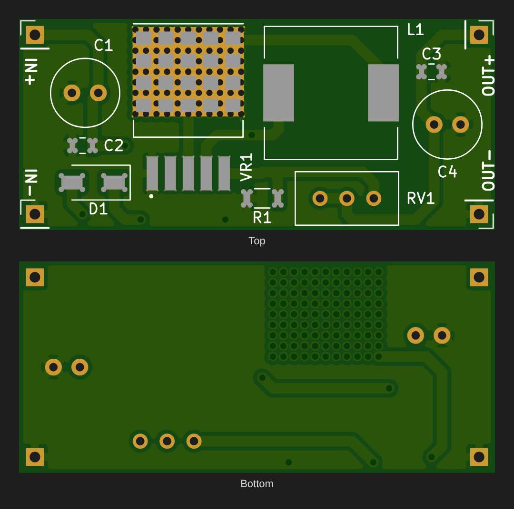
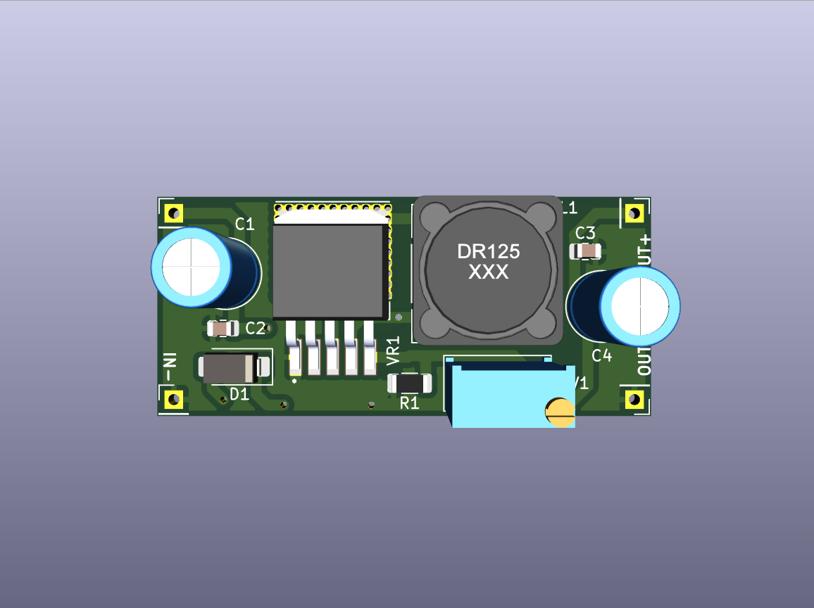
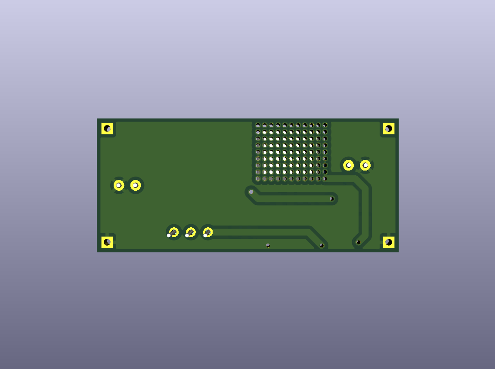

# Boost Converter (XL6009)

An adjustable step-up DC-DC converter built around the **XL6009** switching regulator. It raises a lower DC input to a higher, regulated DC output, which you set with a multi-turn trimmer.










## Overview

The boost converter is the basic step-up switch-mode topology. Energy is stored in an inductor while a switch is on, then released to the output, on top of the input voltage, while the switch is off. The XL6009 integrates the power switch (4 A), oscillator (400 kHz) and control loop, so the design needs only an inductor, a Schottky diode, capacitors and a feedback divider.

## Working Principle

1. **Switch ON:** the XL6009's internal switch connects the SW node (the end of L1) to GND. Input current ramps up through L1, storing energy in its magnetic field. D1 is reverse-biased, so C4 supplies the load.
2. **Switch OFF:** the switch opens. L1 keeps its current flowing, which forces the SW node above the input voltage. D1 (SS34 Schottky) conducts and delivers energy to C4 and the load.
3. **Regulation:** the output is divided down by RV1 (50 kΩ trimmer) and R1 (1 kΩ) into the FB pin. The XL6009 adjusts its duty cycle to hold FB at 1.25 V.
4. **Filtering:** C1 (47 µF) and C2 (1 µF) decouple the input, and C4 (220 µF) and C3 (1 µF) smooth the output.
5. **Enable:** the EN pin is left unconnected. On the XL6009 a floating EN defaults high, so the converter is always on.

## Key Equations

**Output voltage (feedback divider, V_FB = 1.25 V):**
```
Vout = 1.25 V × (1 + RV1 / R1)
     = 1.25 × (1 + 0…50k / 1k)  →  set range ≈ Vin … 63 V (see Design Notes)
```

**Duty cycle (continuous conduction mode):**
```
D = 1 − Vin / Vout          e.g. 12 V → 24 V : D = 0.5
```

**Inductor ripple current:**
```
ΔI_L = Vin × D / (L × f) = 12 × 0.5 / (33 µH × 400 kHz) ≈ 0.45 A
```

**Output voltage ripple (capacitive part):**
```
ΔVout ≈ Iout × D / (f × C4) = 1 A × 0.5 / (400 kHz × 220 µF) ≈ 6 mV
```

**Input current (power balance):**
```
Iin ≈ (Vout × Iout) / (Vin × η)      η ≈ 85–94 %
```

## Typical Applications

- Running 12 V / 19 V / 24 V devices from a 5 V USB or single Li-ion supply
- Laptop chargers in the car (12 V → 19 V)
- Solar and battery systems that need a higher bus voltage
- Bench supply for testing high-voltage LEDs, motors and other loads

## Specifications (this design)

| Parameter | Value |
|---|---|
| Input Voltage | 5–32 V DC (XL6009 range) |
| Output Voltage | Adjustable, Vin to ~35 V (XL6009 / SS34 limit) |
| Switch Current | 4 A peak (internal switch) |
| Switching Frequency | 400 kHz (fixed) |
| Feedback Reference | 1.25 V |
| Board Size | 45 × 20 mm, 2-layer, thermal-via array under VR1 |

## Bill of Materials

| Ref | Value | Package | Qty |
|---|---|---|---|
| VR1 | XL6009 boost regulator | TO-263-5 | 1 |
| L1 | 33 µH power inductor (CDRH127-type, 12 × 12 mm) | SMD | 1 |
| D1 | SS34 Schottky diode (40 V, 3 A) | SMA | 1 |
| C1 | 47 µF / 50 V electrolytic | Radial D6.3 mm | 1 |
| C4 | 220 µF / 50 V electrolytic | Radial D6.3 mm | 1 |
| C2, C3 | 1 µF ceramic | 0805 | 2 |
| R1 | 1 kΩ | 1206 | 1 |
| RV1 | 50 kΩ multi-turn trimmer | Bourns 3296W | 1 |
| J1–J4 | IN+ / IN− / OUT+ / OUT− pads | 2.54 mm pin | 4 |

## Design Notes

- **The trimmer can ask for more voltage than the parts can handle.** With R1 = 1 kΩ and RV1 = 50 kΩ, the feedback divider can request up to about 63 V. The XL6009 is specified up to ~35 V output, the SS34 is rated at 40 V and the capacitors at 50 V. **Set the voltage with no load and a meter connected, turning the trimmer slowly.** To limit the range in hardware, change R1 to 2 kΩ, which caps Vout at about 32.5 V.
- **A boost converter can't go below Vin.** When the switch is off, the input connects straight to the output through L1 and D1. Vout is always at least about Vin − 0.4 V, and there's no short-circuit protection on the output.
- **Thermal design.** VR1's tab sits on a large array of thermal vias into a bottom copper pour. Above ~1.5 A input current, add airflow or a heatsink.
- **Layout.** Keep the SW node (L1 / D1 / VR1 pin 3) loop small, as this layout does, to minimise switching noise.

## Pros & Cons

**Pros:**
- Simple topology with few components and an integrated 4 A switch
- High efficiency (typically 85–94 %)
- Wide adjustable output range with a 25-turn trimmer
- The 400 kHz switching frequency allows a small inductor and capacitors

**Cons:**
- Non-isolated (output shares ground with the input)
- No current limiting or short-circuit protection at the output
- Input current is higher than output current; the source must supply Iin ≈ Vout·Iout / (Vin·η)
- The trimmer range exceeds the part ratings unless R1 is changed (see Design Notes)

## Files in This Folder

| File | Description |
|---|---|
| `boost-converter.kicad_pro` | KiCad project file |
| `boost-converter.kicad_sch` | Schematic source file |
| `boost-converter.kicad_pcb` | PCB layout source file |
| `boost-converter-PTH.drl` | Plated through-hole drill file |
| `boost-converter-NPTH.drl` | Non-plated through-hole drill file |
| `gerbers/` | Gerber files for fabrication |
| `schematic.png` | Schematic preview image |
| `pcb-layout2.png` | PCB layout preview (KiCad editor view) |
| `pcb-layout.png` | PCB top and bottom render from the Gerbers |
| `pcb-3d-top.png` | 3D render, top side |
| `pcb-3d-bottom.png` | 3D render, bottom side |

## How to Use

1. Clone or download this repository.
2. Open `boost-converter.kicad_pro` in [KiCad](https://www.kicad.org/) (v10 or later).
3. To manufacture, zip the contents of `gerbers/` together with the two `.drl` files and upload them to any PCB fab.
4. After assembly, connect the supply to **IN+ / IN−**. With no load attached and a multimeter on **OUT+ / OUT−**, turn RV1 until you reach the voltage you need, then connect the load.

## License

Released under the [MIT License](../LICENSE).
