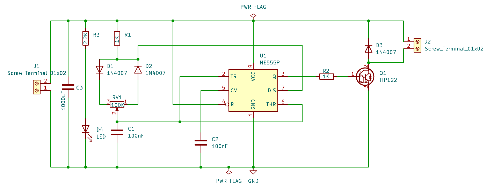
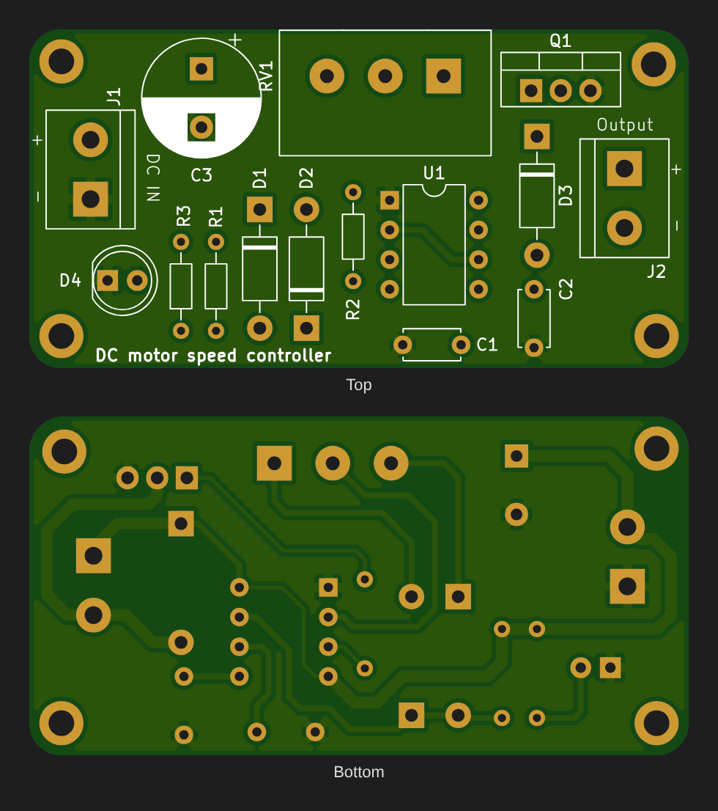
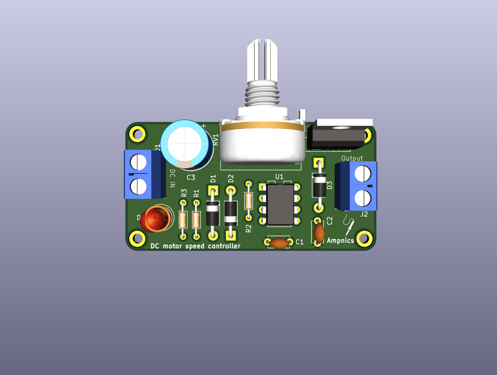
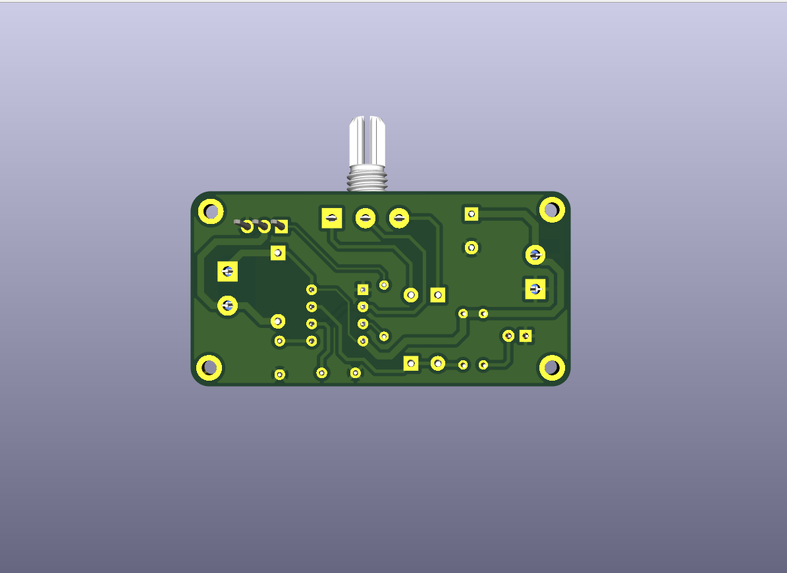

# DC Motor Speed Controller (555 PWM)

A PWM speed controller for brushed DC motors. An NE555 timer generates a fixed-frequency PWM signal whose duty cycle is set by a potentiometer, and a TIP122 Darlington transistor switches the motor current.










## Overview

Reducing a DC motor's supply with a series resistor wastes power as heat and kills low-speed torque. **Pulse-width modulation (PWM)** instead switches the motor fully on and fully off many times a second. The motor's inductance and mechanical inertia average the pulses, so the effective voltage is set by the **duty cycle**:

```
V_avg = D × Vin
```

Because the switching transistor is either fully on or fully off, very little power is lost in it, and the motor keeps good torque even at low speed.

## Working Principle

1. **Oscillator:** the NE555 runs in astable mode. Steering diodes D1 and D2 split the potentiometer RV1 into a charge path and a discharge path.
2. **Charging (output HIGH):** C1 charges from VCC through R1, D1 and one side of RV1 (pin 3 to the wiper).
3. **Discharging (output LOW):** C1 discharges through the other side of RV1 (wiper to pin 1) and D2 into the 555's discharge pin (7).
4. **Duty-cycle control:** turning RV1 moves resistance from one path to the other. This changes the duty cycle while the **total period stays almost constant**, so speed changes without the frequency drifting.
5. **Power stage:** the 555 output drives the TIP122's base through R2 (1 kΩ). The TIP122 switches the motor's low side; the motor sits between VCC (J2 +) and the collector (J2 −).
6. **Flyback protection:** D3 is across the motor and clamps the inductive voltage spike when the transistor turns off.
7. **Supply and indicator:** C3 (1000 µF) is the bulk decoupling capacitor and absorbs motor current spikes. C2 (100 nF) stabilises the 555's control-voltage pin, and D4 lights through R3 (2.2 kΩ) when power is on.

## Key Equations

**PWM period and frequency (independent of pot position):**
```
T ≈ 0.693 × (R1 + RV1) × C1 = 0.693 × 101 kΩ × 100 nF ≈ 7 ms
f ≈ 1 / T ≈ 143 Hz
```

**Duty cycle (Ra = charge-side part of RV1):**
```
D ≈ (R1 + Ra) / (R1 + RV1)      →  ≈ 1 % … 99 %
```

**Average motor voltage:**
```
V_motor ≈ D × (Vin − V_CE(sat))      V_CE(sat) of TIP122 ≈ 1–2 V
```

**TIP122 base current (12 V supply):**
```
I_B ≈ (V_OH − 2 × V_BE) / R2 ≈ (10.5 − 1.4) / 1k ≈ 9 mA
I_C(max) ≈ h_FE × I_B ≫ motor current   (h_FE ≥ 1000)
```

**Transistor dissipation (sets heatsink need):**
```
P_Q1 ≈ V_CE(sat) × I_motor × D
```

## Typical Applications

- Speed control for 12 V DC fans, pumps and small gear motors
- DIY drills, grinders and hobby machines
- LED-strip dimming (the same circuit drives resistive loads)
- Robotics and conveyor prototypes

## Specifications (this design)

| Parameter | Value |
|---|---|
| Input Voltage | 5–15 V DC (NE555 limit: 16 V) |
| Output | PWM, low-side switched, ≈ 1–99 % duty |
| PWM Frequency | ≈ 143 Hz |
| Output Current | Up to ~3 A with a heatsink on Q1 (TIP122 rating: 5 A) |
| Board Size | 56.5 × 29 mm, 2-layer, 4 × mounting holes |

## Bill of Materials

| Ref | Value | Package | Qty |
|---|---|---|---|
| U1 | NE555P timer | DIP-8 | 1 |
| Q1 | TIP122 Darlington NPN | TO-220 | 1 |
| RV1 | 100 kΩ potentiometer | Alps RK163, single | 1 |
| R1, R2 | 1 kΩ, ¼ W | Axial DIN0204 | 2 |
| R3 | 2.2 kΩ, ¼ W | Axial DIN0204 | 1 |
| C1, C2 | 100 nF ceramic | Disc, P5 mm | 2 |
| C3 | 1000 µF electrolytic (≥ 25 V) | Radial D10 mm, P5 mm | 1 |
| D1, D2 | 1N4007 (steering) | DO-41 | 2 |
| D3 | 1N4007 (flyback) | DO-41 | 1 |
| D4 | 5 mm LED | THT | 1 |
| J1, J2 | 2-pin screw terminal, 5.08 mm | THT | 2 |

## Design Notes

- **Supply voltage:** the 555 runs directly from the input, so keep Vin ≤ 15 V. For higher-voltage motors (24 V), feed the 555 from a 7812 or a zener-regulated rail.
- **Heatsink:** the TIP122 is a Darlington with a 1–2 V saturation drop, so it dissipates noticeable power. Fit a heatsink on Q1 above about 1 A. For high currents, a logic-level MOSFET (e.g. IRLZ44N) runs much cooler.
- **Flyback diode:** the 1N4007 works at 143 Hz, but a fast or Schottky diode (UF4007, 1N5819) handles the switching edges better.
- **Audible whine:** 143 Hz is within the audible range, so some motors will hum. Lowering C1 to 10 nF moves the PWM to about 1.4 kHz.

## Pros & Cons

**Pros:**
- Efficient compared with resistive or linear speed control
- Keeps good torque at low speed
- Constant frequency across the whole speed range
- Cheap, common, all-through-hole parts

**Cons:**
- One direction only (no H-bridge)
- Open-loop: speed changes with load, because there is no feedback
- The Darlington's saturation drop limits efficiency at high current
- Low PWM frequency can cause audible motor noise

## Files in This Folder

| File | Description |
|---|---|
| `dc-motor-speed-controller.kicad_pro` | KiCad project file |
| `dc-motor-speed-controller.kicad_sch` | Schematic source file |
| `dc-motor-speed-controller.kicad_pcb` | PCB layout source file |
| `dc-motor-speed-controller-PTH.drl` | Plated through-hole drill file |
| `dc-motor-speed-controller-NPTH.drl` | Non-plated through-hole drill file |
| `gerbers/` | Gerber files for fabrication |
| `schematic.png` | Schematic preview image |
| `pcb-layout2.png` | PCB layout preview (KiCad editor view) |
| `pcb-layout.png` | PCB top and bottom render from the Gerbers |
| `pcb-3d-top.png` | 3D render, top side |
| `pcb-3d-bottom.png` | 3D render, bottom side |

## How to Use

1. Clone or download this repository.
2. Open `dc-motor-speed-controller.kicad_pro` in [KiCad](https://www.kicad.org/) (v10 or later).
3. To manufacture, zip the contents of `gerbers/` together with the two `.drl` files and upload them to any PCB fab.
4. After assembly, connect the DC supply to J1 (**DC IN**, + / −) and the motor to J2 (**Output**, + / −). Turn RV1 to set the speed.

## License

Released under the [MIT License](../LICENSE).
