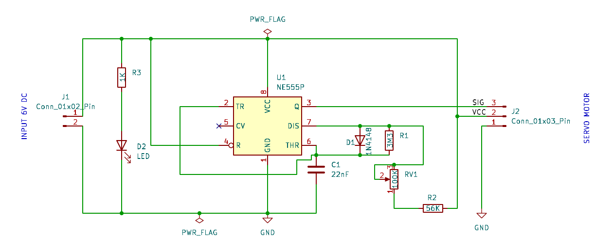
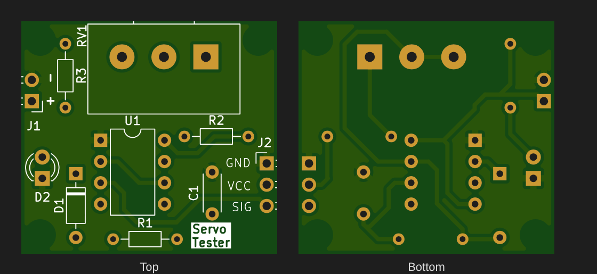

# Servo Tester (NE555)

A standalone servo tester built around an NE555 timer. It generates the PWM control pulse a hobby servo expects, and turning the potentiometer sweeps the servo through its range. No microcontroller or code is needed.






## Overview

Hobby servos (SG90, MG995, etc.) set their shaft angle from the **width of a repeating pulse**: about 1 ms for one end, 1.5 ms for centre and 2 ms for the other end. This board makes that pulse with a 555 in astable mode. A steering diode separates the charge and discharge paths, so the pulse width (high time) and the gap between pulses (low time) can be set independently. That lets the board produce a short pulse with a long gap, which a plain 555 astable can't do.

## Working Principle

1. **Charging (output HIGH):** C1 charges from VCC through R2 + RV1 and diode D1, which bypasses R1. This sets the **pulse width**, and turning RV1 changes it.
2. **Discharging (output LOW):** when C1 reaches ⅔ VCC, the 555's discharge pin (7) pulls low. C1 discharges through R1 (3.3 MΩ) only, because D1 is now reverse-biased. This sets the **gap between pulses**.
3. **Output:** pin 3 (Q) drives the servo's signal line on J2. J2 also passes VCC and GND through to power the servo.
4. **Indicator:** D2 lights through R3 (1 kΩ) whenever the board is powered.

## Key Equations

**Pulse width (output HIGH, set by RV1):**
```
t_high = 0.693 × (R2 + RV1) × C1
       = 0.693 × (56k … 156k) × 22 nF ≈ 0.85 ms … 2.4 ms
```

**Gap between pulses (output LOW):**
```
t_low = 0.693 × R1 × C1 = 0.693 × 3.3 MΩ × 22 nF ≈ 50 ms
```

**Frame period and frequency:**
```
T = t_high + t_low ≈ 51–53 ms   →   f ≈ 19 Hz
```

**Indicator LED current (6 V supply):**
```
I_LED = (VCC − V_LED) / R3 ≈ (6 − 2) / 1k ≈ 4 mA
```

## Typical Applications

- Bench-testing servos before fitting them in an RC model or robot
- Centring a servo horn during assembly
- Checking a servo for jitter, dead band or stripped gears
- Driving a servo manually with no Arduino or receiver

## Specifications (this design)

| Parameter | Value |
|---|---|
| Supply Voltage | 6 V DC (4.8–6 V servo range; NE555 accepts 4.5–16 V) |
| Pulse Width | ≈ 0.85 ms to 2.4 ms, adjustable with RV1 |
| Frame Rate | ≈ 19 Hz (≈ 52 ms period) |
| Output | 3-pin servo header: GND / VCC / SIG |
| Board Size | 30.5 × 27.75 mm, 2-layer, 4 × mounting holes |

## Bill of Materials

| Ref | Value | Package | Qty |
|---|---|---|---|
| U1 | NE555P timer | DIP-8 | 1 |
| RV1 | 100 kΩ potentiometer | Alps RK163, single | 1 |
| R1 | 3.3 MΩ, ¼ W | Axial DIN0204 | 1 |
| R2 | 56 kΩ, ¼ W | Axial DIN0204 | 1 |
| R3 | 1 kΩ, ¼ W | Axial DIN0204 | 1 |
| C1 | 22 nF ceramic | Disc, P5 mm | 1 |
| D1 | 1N4148 | DO-35 | 1 |
| D2 | 3 mm LED | THT | 1 |
| J1 | 2-pin header (power in) | 2.54 mm | 1 |
| J2 | 3-pin header (servo) | 2.54 mm | 1 |

## Design Notes

- **The pulse range is wider than standard.** The standard range is 1–2 ms, but this board goes from about 0.85 ms to 2.4 ms. At the ends of the pot's travel, some servos will push against their mechanical end stops and buzz. To trim the range to about 0.9–2.1 ms, change R2 to 62 kΩ and RV1 to 50 kΩ, or reduce C1.
- **The frame rate is lower than standard.** About 19 Hz is slower than the usual 50 Hz (20 ms period). Most analog servos don't mind, but some digital servos may jitter or lose holding torque. To get about 50 Hz, change R1 to 1.2 MΩ (t_low ≈ 18 ms).
- **Supply.** The servo takes its power from J1 through J2. Use a supply that can deliver the servo's stall current, which is often 0.5–1 A or more. Don't power it from a microcontroller's 5 V pin.

## Pros & Cons

**Pros:**
- Simple, cheap and code-free; all through-hole parts
- Pulse width and frame rate are set independently (diode steering)
- Small enough to keep in a toolbox

**Cons:**
- Pulse width drifts with temperature and component tolerance (it is an RC timer)
- Manual control only: no auto-sweep or centre-detent mode
- The pot's end positions overshoot the standard 1–2 ms range (see Design Notes)

## Files in This Folder

| File | Description |
|---|---|
| `servo-tester.kicad_pro` | KiCad project file |
| `servo-tester.kicad_sch` | Schematic source file |
| `servo-tester.kicad_pcb` | PCB layout source file |
| `servo-tester-PTH.drl` | Plated through-hole drill file |
| `servo-tester-NPTH.drl` | Non-plated through-hole drill file |
| `gerbers/` | Gerber files for fabrication |
| `schematic.png` | Schematic preview image |
| `pcb-layout2.png` | PCB layout preview (KiCad editor view) |
| `pcb-layout.png` | PCB top and bottom render from the Gerbers |

## How to Use

1. Clone or download this repository.
2. Open `servo-tester.kicad_pro` in [KiCad](https://www.kicad.org/) (v10 or later).
3. To manufacture, zip the contents of `gerbers/` together with the two `.drl` files and upload them to any PCB fab.
4. After assembly, connect a 6 V supply to J1 (observe the + / − marking) and the servo to J2 (GND / VCC / SIG). Then turn RV1 to sweep the servo.

## License

Released under the [MIT License](../LICENSE).
