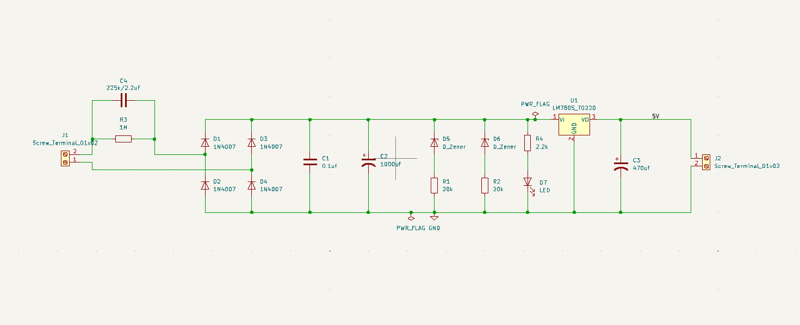
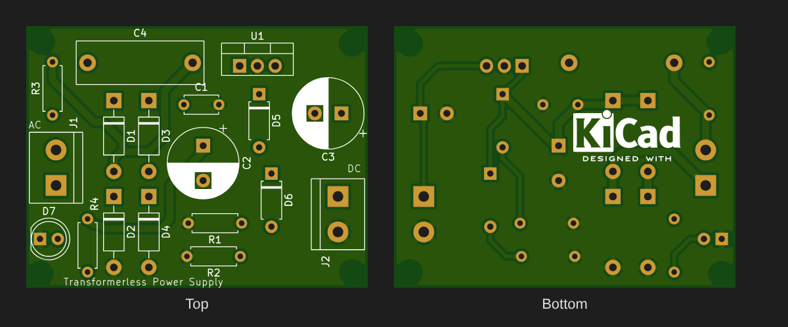

# Transformerless Power Supply (Capacitive Dropper)

An AC-DC power supply that produces a **regulated 5 V DC** output directly from **230 V AC mains** without a transformer. A high-voltage X-rated capacitor drops the voltage, a bridge rectifier converts it to DC, and an LM7805 regulates the output.

> ⚠️ **DANGER — mains voltage, no isolation.** Every point on this board, **including the 5 V output and GND**, can be at lethal mains potential. Never touch the board while it's plugged in, never connect it to a grounded device (PC, oscilloscope, USB), and only build it if you know how to work safely with mains.






## Overview

Transformerless (capacitive dropper) supplies are used where cost and size matter more than isolation: smart plugs, LED bulbs, small appliance controllers and energy meters. Instead of stepping the voltage down with a transformer, a capacitor in series with the mains limits the **current**. Because a capacitor's reactance dissipates almost no real power, this dropper stays cool, unlike a resistive dropper.

## Working Principle

1. **Current limiting:** C4 (2.2 µF, code "225") is in series with the mains live line. Its reactance at 50 Hz limits the current to about 150 mA. R3 (1 MΩ) is a bleeder that discharges C4 once the supply is unplugged.
2. **Rectification:** D1–D4 (1N4007) form a full-wave bridge.
3. **Filtering:** C2 (1000 µF) is the bulk reservoir capacitor, and C1 (0.1 µF) bypasses high-frequency noise.
4. **Voltage clamping:** zener diodes D5 and D6 are meant to hold the rectified rail at a safe level for the regulator. (See [Design Notes](#design-notes).)
5. **Regulation:** U1 (LM7805) regulates the rail to 5 V, and C3 (470 µF) stabilises the output.
6. **Indicator:** D7 lights through R4 (2.2 kΩ) when the rail is up.

## Key Equations

**Dropper capacitor reactance:**
```
Xc = 1 / (2π × f × C) = 1 / (2π × 50 × 2.2 µF) ≈ 1.45 kΩ
```

**Maximum available current (Vrail ≪ Vmains):**
```
I ≈ Vmains / Xc = 230 / 1447 ≈ 159 mA (RMS)
```
The dropper acts as a **current source**: the board must always sink this current, either through the load or through the zener clamp.

**Sizing C4 for a required current:**
```
C = I / (2π × f × Vmains)
```

**Bleeder discharge (R3 × C4):**
```
τ = 1 MΩ × 2.2 µF = 2.2 s
P(R3) = 230² / 1 MΩ ≈ 53 mW
```

**Regulator dissipation:**
```
P(U1) = (Vrail − 5 V) × I_load
```

## Typical Applications

- Smart plugs, Wi-Fi switches and IoT relays (powering a microcontroller from mains)
- LED bulbs and drivers
- Energy meters, timers and small appliance control boards
- Any sealed, low-current (< 100 mA) device where isolation isn't required

## Specifications (this design)

| Parameter | Value |
|---|---|
| Input Voltage | 230 V AC, 50 Hz (mains, direct) |
| Output Voltage | 5 V DC regulated (LM7805) |
| Output Current | ≤ 100 mA recommended (dropper limit ≈ 150 mA total) |
| Isolation | **None** |
| Board Size | 48.75 × 37.5 mm, 2-layer, 4 × mounting holes |

## Bill of Materials

| Ref | Value | Package | Qty |
|---|---|---|---|
| C4 | 2.2 µF (225K) **X2-rated, ≥ 275 V AC** polypropylene | Rect. 18 × 6 mm, P15 mm | 1 |
| R3 | 1 MΩ, ¼ W | Axial DIN0207 | 1 |
| D1–D4 | 1N4007 | DO-41 | 4 |
| C1 | 0.1 µF ceramic | Disc, P5 mm | 1 |
| C2 | 1000 µF electrolytic (≥ 25 V) | Radial D10 mm, P5 mm | 1 |
| D5, D6 | Zener diode (see Design Notes) | DO-41 / A-405 | 2 |
| R1, R2 | 20 kΩ, ¼ W | Axial DIN0207 | 2 |
| R4 | 2.2 kΩ, ¼ W | Axial DIN0207 | 1 |
| D7 | 5 mm LED | THT | 1 |
| U1 | LM7805 | TO-220 | 1 |
| C3 | 470 µF electrolytic (≥ 10 V) | Radial D10 mm, P3.8 mm | 1 |
| J1, J2 | 2-pin screw terminal, 5.08 mm | THT | 2 |

## Design Notes

These are known issues with the current revision, recorded so that anyone building it doesn't get caught out:

- **The zener clamp is ineffective.** Each zener (D5, D6) is in series with a 20 kΩ resistor, so the two branches together can only sink about 1 mA. The dropper delivers about 150 mA, and with a light load or none, the voltage on C2 will rise towards the mains peak (~325 V). That exceeds the LM7805's 35 V input limit and C2's voltage rating. **Fix:** put one 1 W zener (12–15 V) directly across C2, with no series resistor, so it can absorb the full dropper current.
- **No input protection.** The production checklist for capacitive droppers is:
  - a fuse in series with the live line
  - a ~100 Ω, 1 W surge-limiting resistor in series with C4 to limit inrush at switch-on
  - a MOV across the input to absorb mains spikes
- **Component ratings.** C4 **must** be an X2 safety capacitor, because an ordinary film capacitor can fail short-circuit across the mains. C2's voltage rating must be above the zener voltage.
- **Current budget.** The available current is fixed by C4. The load, the LED, the regulator's quiescent current and the zener all share it. Increase C4 if you need more output current.

## Pros & Cons

**Pros:**
- Very small, light and cheap; no transformer
- The capacitive dropper dissipates almost no power
- Simple through-hole design

**Cons:**
- **No galvanic isolation**: a shock hazard, and unsafe for any user-accessible output
- Output current is fixed and small (tens of mA)
- Poor efficiency at light load, because the zener burns the excess current
- Sensitive to mains surges and frequency (50 vs 60 Hz changes the current)

## Files in This Folder

| File | Description |
|---|---|
| `transformerless-power-supply.kicad_pro` | KiCad project file |
| `transformerless-power-supply.kicad_sch` | Schematic source file |
| `transformerless-power-supply.kicad_pcb` | PCB layout source file |
| `transformerless-power-supply-PTH.drl` | Plated through-hole drill file |
| `transformerless-power-supply-NPTH.drl` | Non-plated through-hole drill file |
| `gerbers/` | Gerber files for fabrication |
| `schematic.png` | Schematic preview image |
| `pcb-layout2.png` | PCB layout preview (KiCad editor view) |
| `pcb-layout.png` | PCB top and bottom render from the Gerbers |

## How to Use

1. Clone or download this repository.
2. Open `transformerless-power-supply.kicad_pro` in [KiCad](https://www.kicad.org/) (v10 or later).
3. Apply the fixes in [Design Notes](#design-notes) before ordering boards.
4. To manufacture, zip the contents of `gerbers/` together with the two `.drl` files and upload them to any PCB fab.
5. Test it for the first time through an isolation transformer, or a series bulb limiter, never straight from the wall socket.

## License

Released under the [MIT License](../LICENSE).
