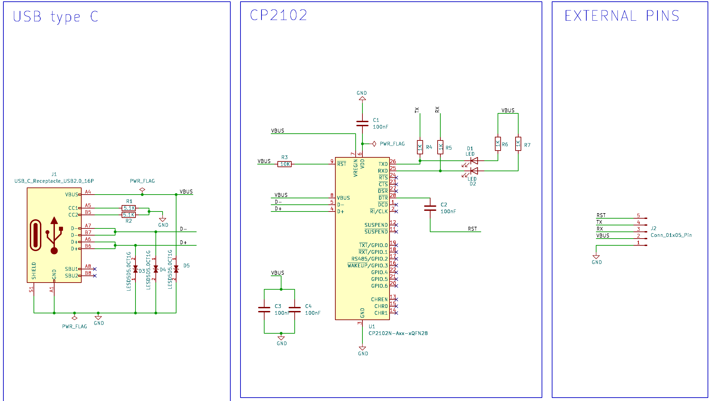
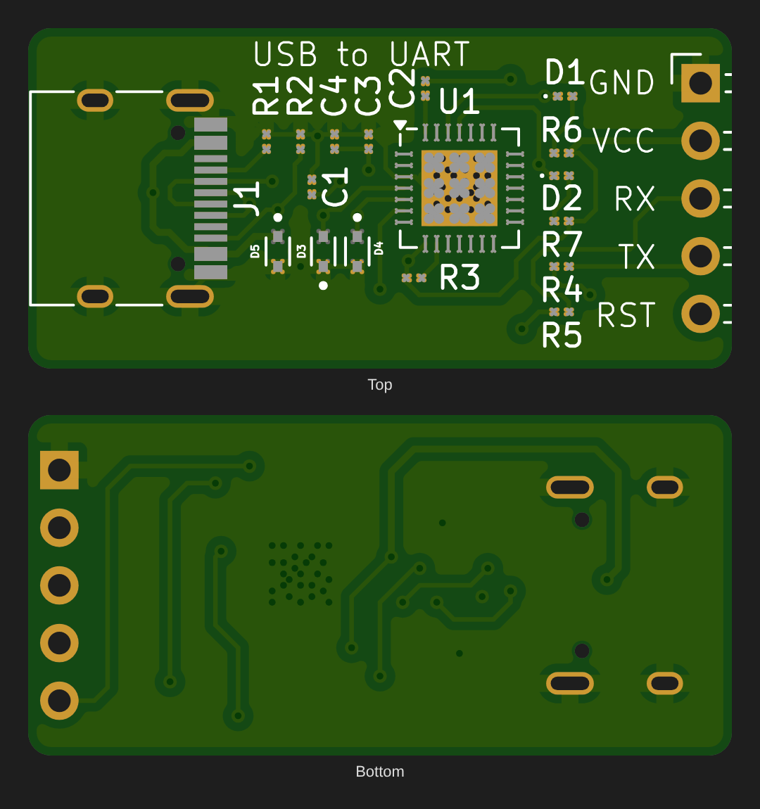

# USB to UART Converter (CP2102N, USB-C)

A compact USB-C to serial (UART) adapter based on the Silicon Labs **CP2102N**. It lets a PC talk to microcontrollers and modules over TX/RX, and has a DTR-driven **RST** pin for Arduino-style auto-reset during upload.






## Overview

Most microcontrollers (ESP32, ESP8266, AVR, STM32) and many modules (GPS, GSM, Bluetooth) talk over a **UART**, but modern PCs only have USB. This board bridges the two. The CP2102N enumerates as a virtual COM port on the PC and converts USB packets to and from TX/RX serial data. It also exposes the modem-control line DTR, which is used to reset the target automatically.

## Working Principle

1. **USB-C input (J1):** R1 and R2 (5.1 kΩ) pull CC1 and CC2 to GND, which identifies the board to the host as a USB sink, so a USB-C host supplies 5 V on VBUS. Both D+/D− pairs are joined, so the connector works either way round.
2. **ESD protection:** three LESD5D5.0CT1G TVS diodes (D3–D5) clamp static discharge on D+, D− and VBUS.
3. **USB-UART bridge (U1):** the CP2102N is powered from VBUS (VREGIN and VBUS pins). Its internal regulator makes 3.3 V on VDD (decoupled by C1), and that sets the logic level of TX/RX. R3 (10 kΩ) holds the reset pin high, and C3/C4 decouple VBUS.
4. **Serial lines:** TXD and RXD go to the header through 1 kΩ series resistors (R4, R5), which protect against wiring mistakes.
5. **Activity LEDs:** D1 (TX) and D2 (RX) are connected from VBUS, through R6/R7, to the data pins, so they flash when data pulls the line low.
6. **Auto-reset:** DTR (pin 28) is AC-coupled through C2 (100 nF) to the **RST** pin. When the PC opens the port, DTR's falling edge produces a short reset pulse on the target, as on Arduino and ESP boards.

## Key Equations

**USB-C sink detection (Rd on each CC pin):**
```
Rd = 5.1 kΩ  →  host sees a sink and enables VBUS (default USB power, 500 mA / 900 mA)
```

**UART bit time:**
```
t_bit = 1 / baud      e.g. 115200 baud → 8.68 µs per bit
```

**Auto-reset pulse (C2 into the target's RST pull-up, typically 10 kΩ):**
```
τ = R_pullup × C2 = 10 kΩ × 100 nF = 1 ms
```

**Activity LED current (while the line is low):**
```
I_LED ≈ (VBUS − V_LED) / (R6 or R7) ≈ (5 − 2) / 1k ≈ 3 mA
```

## Typical Applications

- Programming ESP32 / ESP8266 / Arduino Pro Mini / AVR boards (with auto-reset)
- Serial debug console for microcontrollers and embedded Linux boards
- Talking to GPS, GSM, Bluetooth and Wi-Fi modules with AT commands
- Logging sensor data from a microcontroller to a PC

## Specifications (this design)

| Parameter | Value |
|---|---|
| Host Interface | USB 2.0 Full Speed, USB-C receptacle |
| Bridge IC | CP2102N (QFN-28) |
| Baud Rate | Up to 3 Mbaud (CP2102N limit) |
| Logic Level | 3.3 V on TX / RX (CP2102N internal regulator) |
| Header Pins | GND · VCC (5 V from USB) · RX · TX · RST |
| ESD Protection | TVS on D+, D−, VBUS |
| Board Size | 31 × 15 mm, 2-layer |

## Bill of Materials

| Ref | Value | Package | Qty |
|---|---|---|---|
| U1 | CP2102N-Axx-xQFN28 | QFN-28, 5 × 5 mm | 1 |
| J1 | USB-C receptacle, USB 2.0, 16-pin (HRO TYPE-C-31-M-12) | SMD + THT shell | 1 |
| J2 | 1 × 5 pin header, 2.54 mm, right-angle | THT | 1 |
| D3, D4, D5 | LESD5D5.0CT1G TVS diode | SOD-523 | 3 |
| R1, R2 | 5.1 kΩ (CC pull-downs) | 0201 | 2 |
| R3 | 10 kΩ (reset pull-up) | 0201 | 1 |
| R4, R5 | 1 kΩ (TX/RX series) | 0201 | 2 |
| R6, R7 | 1 kΩ (LED) | 0201 | 2 |
| C1–C4 | 100 nF | 0201 | 4 |
| D1, D2 | LED (TX / RX activity) | 0201 | 2 |

## Design Notes

- **Tiny parts.** All the passives and LEDs use **0201** footprints (0.6 × 0.3 mm), and U1 is a QFN with an exposed pad. This board needs stencil + reflow or PCB-fab assembly; it isn't practical to hand-solder. Change the footprints to 0402 or 0603 if you want to build it by hand.
- **VCC is 5 V but the logic is 3.3 V.** The header's VCC pin carries USB VBUS (5 V), while TX/RX swing 0–3.3 V. That suits most 3.3 V targets (ESP32, STM32) powered from their own regulator. Check that your target's RX accepts 3.3 V as a logic high, and don't feed 5 V from VCC straight into a 3.3 V-only chip.
- **LED supply.** The activity LEDs are fed from 5 V while the data lines idle at 3.3 V, so low-Vf LEDs may glow faintly when idle. Feeding R6/R7 from VDD (3.3 V) instead avoids this.
- **Driver.** Windows 10/11, macOS and Linux include CP210x drivers. On older systems, install the Silicon Labs CP210x VCP driver.

## Pros & Cons

**Pros:**
- Very small, with a modern USB-C connector that works either way round
- ESD protection on all USB lines
- Auto-reset support for one-click Arduino/ESP uploads
- The CP2102N needs no external crystal and has broad OS driver support

**Cons:**
- 0201 parts and QFN make it hard to hand-assemble
- No selectable 3.3 V / 5 V output on the VCC pin
- No RTS / CTS hardware flow control on the header
- Not galvanically isolated from the PC

## Files in This Folder

| File | Description |
|---|---|
| `usb-to-uart-converter.kicad_pro` | KiCad project file |
| `usb-to-uart-converter.kicad_sch` | Schematic source file |
| `usb-to-uart-converter.kicad_pcb` | PCB layout source file |
| `usb-to-uart-converter-PTH.drl` | Plated through-hole drill file (incl. USB-C shell slots) |
| `usb-to-uart-converter-NPTH.drl` | Non-plated drill file (USB-C locating pegs) |
| `gerbers/` | Gerber files for fabrication (incl. paste layers for stencil) |
| `schematic.png` | Schematic preview image |
| `pcb-layout2.png` | PCB layout preview (KiCad editor view) |
| `pcb-layout.png` | PCB top and bottom render from the Gerbers |

## How to Use

1. Clone or download this repository.
2. Open `usb-to-uart-converter.kicad_pro` in [KiCad](https://www.kicad.org/) (v10 or later).
3. To manufacture, zip the contents of `gerbers/` together with the two `.drl` files and upload them to any PCB fab. Order a stencil too, or use the fab's assembly service.
4. Wire the board to your target **crossed over**: board TX → target RX, board RX → target TX, GND → GND. Connect RST to the target's reset/EN pin for auto-reset.
5. Plug in USB-C, select the new COM port in your serial terminal or IDE, and set the baud rate to match the target.

## License

Released under the [MIT License](../LICENSE).
